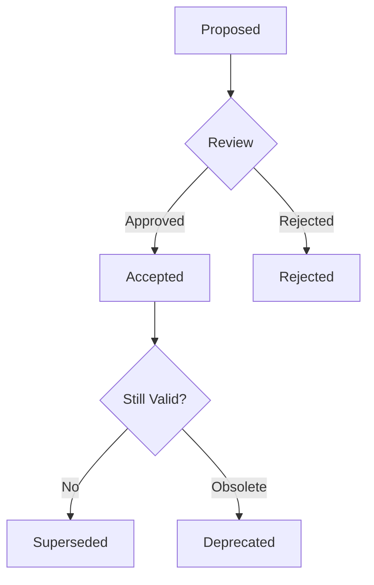

# Architecture Decision Record (ARD) Template

## What is an ARD?

Architecture Decision Records (ARDs) document important architectural decisions made during software development. They help teams understand:
- **Why** certain decisions were made
- **What** alternatives were considered
- **When** the decision was made
- **Who** was involved

## ARD Format

```markdown
# ADR-[NUMBER]: [TITLE]

Date: [YYYY-MM-DD]
Status: [Proposed | Accepted | Superseded | Deprecated]

## Context
What is the issue that we're seeing that is motivating this decision?

## Decision
What is the change that we're proposing and/or doing?

## Alternatives Considered
What other options were evaluated?

1. **Option A**: Description
   - Pros: ...
   - Cons: ...

2. **Option B**: Description
   - Pros: ...
   - Cons: ...

## Consequences
What becomes easier or more difficult because of this change?

### Positive
- ...
- ...

### Negative
- ...
- ...

### Neutral
- ...
- ...

## Implementation
How will this be implemented?

## References
- Link to relevant documentation
- Related ADRs
- External resources
```

## Example ARDs for Economic Engine

### ADR-001: Microservices Architecture
```markdown
# ADR-001: Adopt Microservices Architecture

Date: 2025-01-20
Status: Accepted

## Context
The Economic Engine platform needs to scale different components independently. The AI economy, document processing, and visualization layers have different resource requirements.

## Decision
Implement a microservices architecture with separate services for:
- Economic Engine API (port 3000)
- Slam Integration Layer (port 9999)
- AI Agent Services
- Real-time WebSocket service

## Alternatives Considered
1. **Monolithic Application**
   - Pros: Simpler deployment, easier debugging
   - Cons: Cannot scale components independently

2. **Serverless Functions**
   - Pros: Infinite scalability, pay-per-use
   - Cons: Cold starts, vendor lock-in

## Consequences
### Positive
- Independent scaling of services
- Technology diversity allowed
- Fault isolation

### Negative
- Increased complexity
- Network latency between services
- Distributed system challenges
```

### ADR-002: Feature Flag System
```markdown
# ADR-002: Implement Feature Flag System

Date: 2025-01-20
Status: Accepted

## Context
Need ability to:
- Gradually roll out features
- A/B test functionality
- Quick rollback capabilities
- Reduce deployment risk

## Decision
Build custom feature flag system with:
- Database-backed flag storage
- Real-time flag updates
- User segmentation
- Automatic rollback triggers

## Consequences
### Positive
- Safe feature releases
- Real-time control
- Reduced deployment risk

### Negative
- Additional complexity
- Flag technical debt
- Performance overhead
```

## Automated ARD Generation

The system automatically generates ARDs for:

### 1. New Service Creation
```javascript
// When detected in code:
class NewPaymentService extends BaseService {
  // Triggers ARD generation
}
```

### 2. Major Dependency Changes
```json
// When package.json changes significantly:
{
  "dependencies": {
    "stripe": "^10.0.0" // New payment provider
  }
}
```

### 3. Database Schema Changes
```sql
-- When migrations add new tables:
CREATE TABLE payment_methods (
  -- Triggers ARD for data model changes
);
```

### 4. API Breaking Changes
```javascript
// When API endpoints change:
router.delete('/api/v1/users'); // Removed endpoint
router.post('/api/v2/users');   // New version
```

## ARD Lifecycle



## Best Practices

1. **Keep ADRs Short**: 1-2 pages maximum
2. **Use Simple Language**: Avoid jargon
3. **Date Everything**: Include decision date
4. **Link Related ADRs**: Reference dependencies
5. **Version Control**: Store in `docs/adr/`
6. **Review Regularly**: Update status as needed

## ADR Index

The system maintains an index at `docs/adr/INDEX.md`:

```markdown
# ADR Index

| Number | Title | Status | Date |
|--------|-------|--------|------|
| ADR-001 | Microservices Architecture | Accepted | 2025-01-20 |
| ADR-002 | Feature Flag System | Accepted | 2025-01-20 |
| ADR-003 | Database Selection | Proposed | 2025-01-21 |
```

## Tools Integration

### Generate New ADR
```bash
npm run adr:new "Title of Decision"
```

### List All ADRs
```bash
npm run adr:list
```

### Update ADR Status
```bash
npm run adr:status 001 superseded
```

---

**ADRs: Documenting the "why" behind your architecture!** 📚