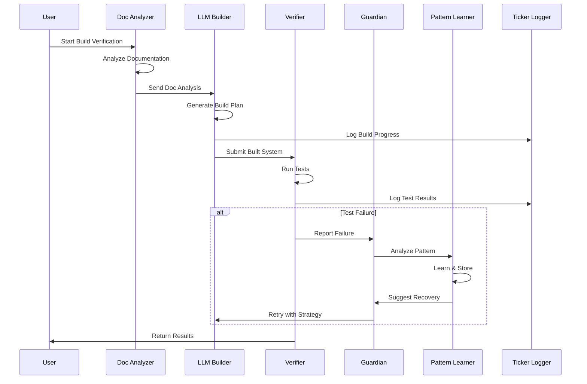

# 📄 BUILD-FROM-SCRATCH VERIFICATION - Technical Specification

*Complete technical architecture, API schemas, and protocol definitions for the Build-From-Scratch Verification System*

## 🏗️ System Architecture

### High-Level Architecture
```
┌─────────────────────────────────────────────────────────────────────────┐
│                     Build-From-Scratch Verification System               │
├─────────────────────────────────────────────────────────────────────────┤
│                                                                         │
│  ┌─────────────────┐  ┌─────────────────┐  ┌─────────────────┐       │
│  │  Documentation  │  │   LLM Build     │  │  Verification   │       │
│  │    Analyzer     │→ │   Orchestrator  │→ │    Engine       │       │
│  └────────┬────────┘  └────────┬────────┘  └────────┬────────┘       │
│           │                     │                     │                 │
│  ┌────────▼────────┐  ┌────────▼────────┐  ┌────────▼────────┐       │
│  │ Debug Pattern   │  │  Auto-Recovery  │  │    Logging      │       │
│  │   Learning      │  │    Guardian     │  │  Architecture   │       │
│  └────────┬────────┘  └────────┬────────┘  └────────┬────────┘       │
│           │                     │                     │                 │
│  ┌────────▼────────────────────▼─────────────────────▼────────┐       │
│  │              Unified Monitoring & Control System            │       │
│  └─────────────────────────────────────────────────────────────┘       │
└─────────────────────────────────────────────────────────────────────────┘
```

### Component Interaction Flow


## 📊 Data Schemas

### Core Data Models

#### BuildVerificationRun
```typescript
interface BuildVerificationRun {
  runId: string;                    // UUID v4
  timestamp: ISO8601;               // Start time
  status: BuildStatus;              // Current status
  configuration: BuildConfig;       // Run configuration
  phases: BuildPhase[];            // Execution phases
  results: BuildResults;           // Final results
  metadata: {
    triggeredBy: string;           // User or system
    environment: string;           // dev/staging/prod
    gitCommit?: string;           // Associated commit
    correlationId: string;        // For distributed tracing
  };
}

enum BuildStatus {
  INITIALIZING = 'initializing',
  ANALYZING_DOCS = 'analyzing_docs',
  BUILDING = 'building',
  VERIFYING = 'verifying',
  COMPLETED = 'completed',
  FAILED = 'failed',
  RECOVERING = 'recovering'
}
```

#### BuildPhase
```typescript
interface BuildPhase {
  phaseId: string;                 // Unique phase ID
  name: string;                    // Human-readable name
  startTime: ISO8601;             // Phase start
  endTime?: ISO8601;              // Phase end
  status: PhaseStatus;            // Current status
  steps: BuildStep[];             // Individual steps
  checkpoints: Checkpoint[];      // Saved states
  errors: BuildError[];           // Encountered errors
  metrics: PhaseMetrics;          // Performance data
}

interface BuildStep {
  stepId: string;
  name: string;
  command?: string;               // Executed command
  output?: string;               // Step output
  duration: number;              // Milliseconds
  success: boolean;
  retryCount: number;
}
```

#### DebugPattern
```typescript
interface DebugPattern {
  patternId: string;              // SHA-256 hash
  errorType: string;              // Classification
  errorMessage: string;           // Original error
  stackTrace?: string;            // Full stack
  component: string;              // Where it occurred
  phase: string;                  // During which phase
  frequency: number;              // Occurrence count
  firstSeen: ISO8601;            // First occurrence
  lastSeen: ISO8601;             // Most recent
  context: {
    systemState: any;            // State when error occurred
    environmentVars: Record<string, string>;
    resourceUsage: ResourceMetrics;
  };
  resolution: {
    strategies: RecoveryStrategy[];
    preventionTest?: string;     // Generated test code
    documentation?: string;      // Fix documentation
  };
}
```

#### RecoveryStrategy
```typescript
interface RecoveryStrategy {
  strategyId: string;
  name: string;
  description: string;
  applicableErrors: string[];     // Pattern IDs
  implementation: {
    type: 'retry' | 'rollback' | 'restart' | 'degrade' | 'custom';
    config: any;                  // Strategy-specific config
  };
  performance: {
    attempts: number;
    successes: number;
    failures: number;
    averageRecoveryTime: number;  // Milliseconds
    lastUsed?: ISO8601;
  };
}
```

#### LogEntry
```typescript
interface LogEntry {
  timestamp: ISO8601;
  level: LogLevel;
  correlationId: string;
  component: string;
  phase?: string;
  message: string;
  data?: any;                    // Structured data
  error?: {
    code: string;
    message: string;
    stack?: string;
  };
  performance?: {
    duration?: number;
    memoryUsed?: number;
    cpuPercent?: number;
  };
  tags: string[];               // For filtering
}

enum LogLevel {
  DEBUG = 'debug',
  INFO = 'info',
  WARN = 'warn',
  ERROR = 'error',
  FATAL = 'fatal'
}
```

### API Specifications

#### Debug Orchestrator API

##### POST /debug/report-error
Report an error for pattern learning.
```typescript
Request {
  error: {
    message: string;
    stack?: string;
    code?: string;
  };
  context: {
    component: string;
    phase: string;
    buildRunId: string;
    additionalData?: any;
  };
}

Response {
  patternId: string;
  isNewPattern: boolean;
  suggestedStrategies: RecoveryStrategy[];
  preventionAvailable: boolean;
}
```

##### GET /debug/patterns
Retrieve learned error patterns.
```typescript
Query {
  component?: string;
  errorType?: string;
  minFrequency?: number;
  since?: ISO8601;
  limit?: number;
  offset?: number;
}

Response {
  patterns: DebugPattern[];
  total: number;
  hasMore: boolean;
}
```

##### POST /debug/generate-tests
Generate prevention tests for patterns.
```typescript
Request {
  patternIds: string[];
  testFramework: 'jest' | 'mocha' | 'tap';
  language: 'javascript' | 'typescript';
}

Response {
  tests: {
    patternId: string;
    testCode: string;
    description: string;
  }[];
  combinedTestSuite: string;
}
```

#### Recovery Guardian API

##### POST /guardian/monitor
Start monitoring a process.
```typescript
Request {
  processId: string;
  processInfo: {
    pid: number;
    command: string;
    args: string[];
    cwd: string;
  };
  healthChecks: HealthCheckConfig[];
  recoveryStrategies: string[];  // Strategy IDs
}

Response {
  monitoringId: string;
  status: 'active' | 'pending';
  checkInterval: number;
}
```

##### GET /guardian/status/:monitoringId
Get monitoring status.
```typescript
Response {
  monitoringId: string;
  processStatus: 'healthy' | 'degraded' | 'critical' | 'dead';
  metrics: {
    uptime: number;
    restarts: number;
    lastRestart?: ISO8601;
    memoryUsage: number;
    cpuUsage: number;
  };
  healthCheckResults: {
    checkName: string;
    status: 'pass' | 'fail';
    lastCheck: ISO8601;
    details?: any;
  }[];
}
```

##### POST /guardian/recover
Trigger manual recovery.
```typescript
Request {
  monitoringId: string;
  strategy: string;  // Strategy ID or 'auto'
  reason: string;
}

Response {
  recoveryId: string;
  strategy: RecoveryStrategy;
  status: 'initiated' | 'in_progress' | 'completed' | 'failed';
  estimatedTime?: number;
}
```

#### Ticker Tape Logger API

##### POST /logger/log
Submit a log entry.
```typescript
Request {
  entries: LogEntry[];  // Batch support
}

Response {
  accepted: number;
  rejected: {
    index: number;
    reason: string;
  }[];
}
```

##### GET /logger/stream
Stream logs via WebSocket.
```typescript
// WebSocket connection
ws://localhost:8888/logger/stream

// Subscribe message
{
  type: 'subscribe',
  filters: {
    components?: string[];
    levels?: LogLevel[];
    correlationId?: string;
    tags?: string[];
  }
}

// Log message
{
  type: 'log',
  entry: LogEntry
}

// Control messages
{
  type: 'pause' | 'resume' | 'clear'
}
```

##### POST /logger/analyze
Analyze log patterns.
```typescript
Request {
  timeRange: {
    start: ISO8601;
    end: ISO8601;
  };
  groupBy: 'component' | 'level' | 'error' | 'phase';
  includeAnomalies: boolean;
}

Response {
  summary: {
    totalEntries: number;
    errorRate: number;
    warningRate: number;
    averageResponseTime?: number;
  };
  groups: {
    name: string;
    count: number;
    trend: 'increasing' | 'stable' | 'decreasing';
  }[];
  anomalies?: {
    timestamp: ISO8601;
    type: string;
    severity: 'low' | 'medium' | 'high';
    description: string;
  }[];
}
```

#### Life Spawn Manager API

##### POST /spawn/process
Spawn a new managed process.
```typescript
Request {
  processConfig: {
    name: string;
    command: string;
    args: string[];
    env?: Record<string, string>;
    cwd?: string;
  };
  lifecycleConfig: {
    autoRestart: boolean;
    maxRestarts: number;
    restartDelay: number;
    backoffStrategy: 'linear' | 'exponential';
  };
  checkpointConfig?: {
    enabled: boolean;
    interval: number;
    maxCheckpoints: number;
  };
}

Response {
  processId: string;
  pid: number;
  status: 'running' | 'starting';
  monitoringUrl: string;
}
```

##### POST /spawn/checkpoint
Create a checkpoint.
```typescript
Request {
  processId: string;
  checkpointData: {
    phase: string;
    state: any;
    metadata?: any;
  };
}

Response {
  checkpointId: string;
  timestamp: ISO8601;
  size: number;  // Bytes
}
```

##### POST /spawn/restore
Restore from checkpoint.
```typescript
Request {
  processId: string;
  checkpointId: string;
  restoreStrategy: 'replace' | 'merge';
}

Response {
  success: boolean;
  restoredState: any;
  newPid?: number;
}
```

### Internal Protocols

#### Inter-Process Communication (IPC)
```typescript
// Message format for IPC between components
interface IPCMessage {
  messageId: string;         // UUID
  timestamp: ISO8601;
  source: string;           // Component name
  destination: string;      // Target component
  type: MessageType;
  payload: any;
  requiresAck: boolean;
  timeout?: number;         // Milliseconds
}

enum MessageType {
  COMMAND = 'command',
  EVENT = 'event',
  QUERY = 'query',
  RESPONSE = 'response',
  HEARTBEAT = 'heartbeat',
  CHECKPOINT = 'checkpoint',
  ERROR = 'error'
}
```

#### Health Check Protocol
```typescript
interface HealthCheckConfig {
  name: string;
  type: 'http' | 'tcp' | 'process' | 'custom';
  interval: number;          // Milliseconds
  timeout: number;
  retries: number;
  config: {
    // HTTP health check
    url?: string;
    method?: string;
    expectedStatus?: number;
    
    // TCP health check
    host?: string;
    port?: number;
    
    // Process health check
    pidFile?: string;
    
    // Custom health check
    script?: string;
    expectedOutput?: string;
  };
  thresholds: {
    healthy: number;         // Success rate %
    degraded: number;
    critical: number;
  };
}
```

#### Checkpoint Protocol
```typescript
interface CheckpointProtocol {
  version: '1.0';
  
  // Checkpoint format
  checkpoint: {
    id: string;
    timestamp: ISO8601;
    processId: string;
    phase: string;
    data: {
      state: any;           // Application state
      metrics: any;         // Performance metrics
      position: any;        // Progress markers
    };
    signature: string;      // SHA-256 hash
    compressed: boolean;
    encryption?: {
      algorithm: string;
      keyId: string;
    };
  };
  
  // Storage backend
  storage: {
    type: 'file' | 'redis' | 's3';
    config: any;
    retention: {
      maxAge: number;       // Seconds
      maxCount: number;
      policy: 'fifo' | 'importance';
    };
  };
}
```

### Performance Specifications

#### Resource Limits
```yaml
components:
  documentation_analyzer:
    memory: 512MB
    cpu: 0.5
    timeout: 60s
    
  llm_builder:
    memory: 2GB
    cpu: 2.0
    timeout: 300s
    
  verification_engine:
    memory: 1GB
    cpu: 1.0
    timeout: 180s
    
  debug_orchestrator:
    memory: 256MB
    cpu: 0.25
    persistent: true
    
  recovery_guardian:
    memory: 128MB
    cpu: 0.1
    persistent: true
    
  ticker_logger:
    memory: 256MB
    cpu: 0.25
    persistent: true
```

#### SLA Requirements
```yaml
availability:
  overall: 99.9%
  critical_path: 99.95%
  
performance:
  documentation_analysis: < 10s
  build_generation: < 300s
  verification: < 180s
  total_runtime: < 600s
  
recovery:
  detection_time: < 5s
  recovery_time: < 30s
  data_loss: 0
  
scaling:
  concurrent_builds: 10
  log_throughput: 10000/s
  pattern_storage: 100000
```

### Security Specifications

#### Authentication & Authorization
```typescript
interface SecurityConfig {
  authentication: {
    type: 'apiKey' | 'jwt' | 'oauth2';
    config: {
      apiKey?: {
        header: string;
        prefix?: string;
      };
      jwt?: {
        secret: string;
        algorithm: string;
        expiresIn: string;
      };
      oauth2?: {
        provider: string;
        clientId: string;
        clientSecret: string;
        callbackUrl: string;
      };
    };
  };
  
  authorization: {
    model: 'rbac' | 'abac';
    roles: {
      name: string;
      permissions: string[];
    }[];
    policies?: any;  // ABAC policies
  };
  
  encryption: {
    transit: {
      enabled: boolean;
      protocol: 'tls1.2' | 'tls1.3';
      ciphers: string[];
    };
    storage: {
      enabled: boolean;
      algorithm: 'aes-256-gcm';
      keyRotation: number;  // Days
    };
  };
}
```

#### API Rate Limiting
```typescript
interface RateLimitConfig {
  global: {
    requests: number;
    window: number;  // Seconds
  };
  
  perEndpoint: {
    endpoint: string;
    limits: {
      authenticated: {
        requests: number;
        window: number;
      };
      anonymous: {
        requests: number;
        window: number;
      };
    };
  }[];
  
  bypass: {
    ips: string[];
    keys: string[];
  };
}
```

## 🔄 State Machines

### Build Verification State Machine
```
┌─────────────┐
│ INITIALIZING │
└──────┬──────┘
       │
       v
┌──────────────┐     ┌─────────────┐
│ ANALYZING_DOCS├────►│   FAILED    │
└──────┬───────┘     └─────────────┘
       │                     ^
       v                     │
┌──────────────┐            │
│   BUILDING   ├────────────┤
└──────┬───────┘            │
       │                     │
       v                     │
┌──────────────┐            │
│  VERIFYING   ├────────────┤
└──────┬───────┘            │
       │                     │
       v                     │
┌──────────────┐            │
│  COMPLETED   │            │
└──────────────┘            │
                            │
┌──────────────┐            │
│  RECOVERING  ├────────────┘
└──────────────┘
```

### Recovery State Machine
```
┌─────────────┐
│   HEALTHY   │
└──────┬──────┘
       │ Failure Detected
       v
┌──────────────┐
│  ANALYZING   │
└──────┬───────┘
       │ Pattern Matched
       v
┌──────────────┐     ┌─────────────┐
│  RECOVERING  ├────►│   FAILED    │
└──────┬───────┘     └─────────────┘
       │ Success
       v
┌──────────────┐
│  VALIDATING  │
└──────┬───────┘
       │ Confirmed
       v
┌──────────────┐
│   HEALTHY    │
└──────────────┘
```

## 🔐 Error Codes

### System Error Codes
```typescript
enum SystemErrorCode {
  // Documentation errors (1xxx)
  DOC_NOT_FOUND = 'E1001',
  DOC_PARSE_ERROR = 'E1002',
  DOC_INCOMPLETE = 'E1003',
  DOC_INVALID_FORMAT = 'E1004',
  
  // Build errors (2xxx)
  BUILD_INIT_FAILED = 'E2001',
  BUILD_ENV_SETUP_FAILED = 'E2002',
  BUILD_GENERATION_FAILED = 'E2003',
  BUILD_COMPILATION_ERROR = 'E2004',
  BUILD_TIMEOUT = 'E2005',
  
  // Verification errors (3xxx)
  VERIFY_TEST_FAILED = 'E3001',
  VERIFY_ENDPOINT_MISSING = 'E3002',
  VERIFY_AUTH_FAILED = 'E3003',
  VERIFY_MATH_INCONSISTENT = 'E3004',
  
  // Recovery errors (4xxx)
  RECOVERY_STRATEGY_FAILED = 'E4001',
  RECOVERY_CHECKPOINT_CORRUPT = 'E4002',
  RECOVERY_MAX_RETRIES = 'E4003',
  RECOVERY_RESOURCE_EXHAUSTED = 'E4004',
  
  // System errors (5xxx)
  SYSTEM_OUT_OF_MEMORY = 'E5001',
  SYSTEM_DISK_FULL = 'E5002',
  SYSTEM_NETWORK_ERROR = 'E5003',
  SYSTEM_PERMISSION_DENIED = 'E5004'
}
```

## 📚 Protocol Extensions

### Custom Health Check Example
```javascript
// custom-health-check.js
module.exports = {
  name: 'build-queue-health',
  
  check: async (context) => {
    const queueDepth = await context.getQueueDepth();
    const processingRate = await context.getProcessingRate();
    const errorRate = await context.getErrorRate();
    
    const health = {
      status: 'healthy',
      metrics: {
        queueDepth,
        processingRate,
        errorRate
      }
    };
    
    if (queueDepth > 100) {
      health.status = 'degraded';
      health.reason = 'Queue backlog detected';
    }
    
    if (errorRate > 0.1) {
      health.status = 'critical';
      health.reason = 'High error rate';
    }
    
    return health;
  }
};
```

### Custom Recovery Strategy Example
```javascript
// custom-recovery-strategy.js
module.exports = {
  name: 'adaptive-retry',
  
  canHandle: (error) => {
    return error.code === 'ECONNREFUSED' || 
           error.code === 'ETIMEDOUT';
  },
  
  execute: async (context, error) => {
    const attempts = context.getAttempts();
    const baseDelay = 1000;
    
    // Adaptive delay based on time of day
    const hour = new Date().getHours();
    const isPeakHour = hour >= 9 && hour <= 17;
    const delayMultiplier = isPeakHour ? 2 : 1;
    
    const delay = baseDelay * Math.pow(2, attempts) * delayMultiplier;
    
    await context.wait(delay);
    
    // Add jitter
    const jitter = Math.random() * 1000;
    await context.wait(jitter);
    
    return context.retry();
  }
};
```

---

*Build-From-Scratch Verification Specification: Technical foundation for bulletproof verification*

**Specification Version:** 2.0.0  
**API Version:** 1.0.0  
**Protocol Version:** 1.0.0