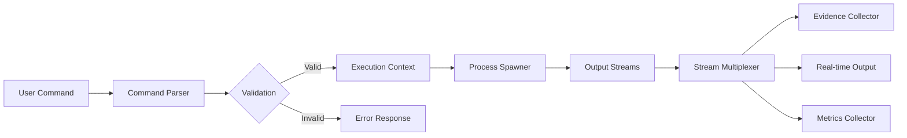
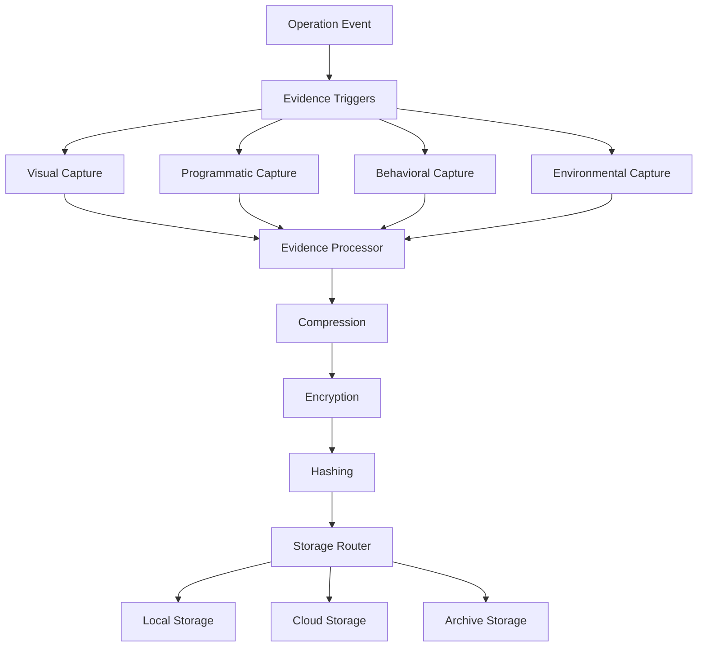
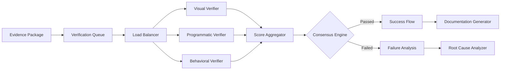
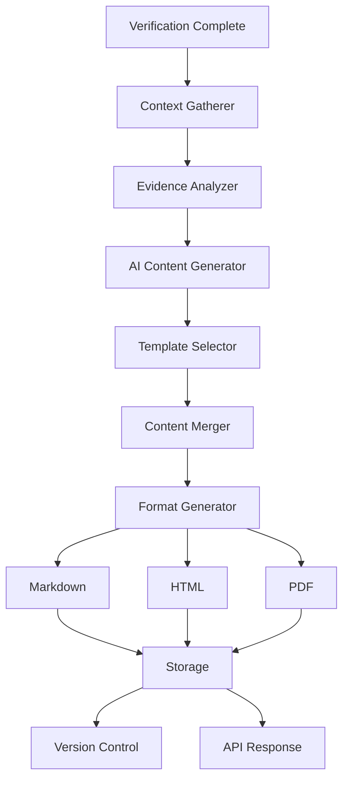
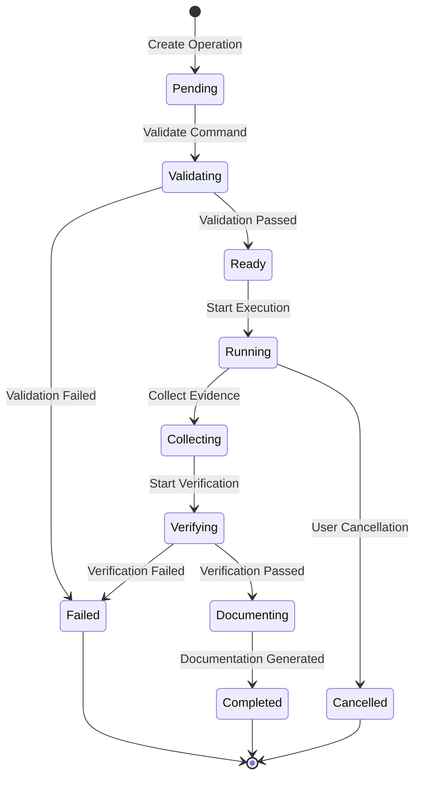

# Data Flow Architecture: Development Reality Engine
## Complete Data Flow Specifications and State Management

**Version:** 1.0.0  
**Date:** 2025-08-12  
**Purpose:** Define how data flows through the system, state transitions, and processing pipelines

---

## Table of Contents

1. [Data Flow Overview](ObsidianVault/02-Documentation/data-flow.md)
2. [Core Data Pipelines](#core-data-pipelines)
3. [State Management](#state-management)
4. [Event Processing](#event-processing)
5. [Data Transformation](#data-transformation)
6. [Caching Strategy](#caching-strategy)
7. [Queue Architecture](FinishThisIdea-Clean/ARCHITECTURE.md)
8. [Stream Processing](#stream-processing)

## Data Flow Overview

### High-Level Data Flow
```
User Input → Command Wrapper → Evidence Collection → Verification → Documentation → Storage
     ↓            ↓                ↓                    ↓              ↓            ↓
  Validation   Execution      Multi-Modal          AI Analysis    Generation   Persistence
                Monitor        Capture              Consensus                    & Archive
```

### Data Categories
1. **Transient Data**: Command output, real-time metrics
2. **Evidence Data**: Screenshots, logs, test results  
3. **Metadata**: Operation details, timestamps, relationships
4. **Derived Data**: Verification scores, AI insights
5. **Archival Data**: Long-term storage, compliance records

## Core Data Pipelines

### 1. Command Execution Pipeline


**Data Flow Steps**:
```javascript
// 1. Command parsing and validation
const command = {
  raw: "npm test --coverage",
  parsed: {
    executable: "npm",
    args: ["test", "--coverage"],
    env: process.env,
    cwd: process.cwd()
  },
  validation: {
    executable_exists: true,
    permissions: "rwx",
    safe_command: true
  }
};

// 2. Execution context creation
const context = {
  operationId: "op_2kj3h4kj234",
  userId: "usr_abc123",
  projectId: "prj_def456",
  timestamp: Date.now(),
  machine: os.hostname(),
  environment: {
    node_version: process.version,
    os: os.platform(),
    arch: os.arch()
  }
};

// 3. Stream processing
const streams = {
  stdout: new PassThrough(),
  stderr: new PassThrough(),
  metrics: new MetricsStream(),
  events: new EventStream()
};

// 4. Multiplexing for multiple consumers
streams.stdout.pipe(evidenceCollector);
streams.stdout.pipe(websocketBroadcaster);
streams.stdout.pipe(logStorage);
```

### 2. Evidence Collection Pipeline


**Evidence Collection Flow**:
```javascript
// 1. Evidence trigger configuration
const triggers = {
  visual: {
    on: ['start', 'error', 'complete'],
    interval: 5000, // Every 5 seconds
    conditions: ['ui_change', 'error_detected']
  },
  programmatic: {
    on: ['test_complete', 'build_finish'],
    collect: ['coverage', 'test_results', 'logs']
  },
  behavioral: {
    continuous: true,
    metrics: ['cpu', 'memory', 'io', 'network']
  }
};

// 2. Evidence collection process
async function collectEvidence(trigger) {
  const evidence = {
    id: generateId(),
    operationId: context.operationId,
    timestamp: Date.now(),
    trigger: trigger.type,
    data: await trigger.collect()
  };
  
  // 3. Processing pipeline
  const processed = await pipeline(evidence)
    .compress()
    .encrypt()
    .hash()
    .sign();
    
  // 4. Storage routing
  await router.store(processed, {
    immediate: 'local',
    backup: 'cloud',
    archive: evidence.size > 10MB ? 'cold' : 'warm'
  });
  
  return processed;
}
```

### 3. Verification Pipeline


**Verification Data Flow**:
```javascript
// 1. Evidence loading and distribution
const verificationJob = {
  id: "vf_5jk6l7m8n",
  operationId: "op_2kj3h4kj234",
  evidence: {
    visual: ["ev_001", "ev_002", "ev_003"],
    programmatic: ["ev_004", "ev_005"],
    behavioral: ["ev_006", "ev_007"]
  },
  config: {
    methods: ["visual", "programmatic", "behavioral"],
    threshold: 0.95,
    timeout: 30000
  }
};

// 2. Parallel verification
const verificationTasks = verificationJob.config.methods.map(method => ({
  method,
  verifier: verifiers[method],
  evidence: verificationJob.evidence[method],
  process: async () => {
    const scores = await Promise.all(
      evidence.map(ev => verifier.verify(ev))
    );
    return {
      method,
      score: average(scores),
      details: scores
    };
  }
}));

// 3. Consensus evaluation
const results = await Promise.all(
  verificationTasks.map(task => task.process())
);

const consensus = {
  scores: results.reduce((acc, r) => ({
    ...acc,
    [r.method]: r.score
  }), {}),
  overall: weightedAverage(results),
  passed: results.filter(r => r.score >= threshold).length >= requiredMethods,
  confidence: calculateConfidence(results)
};
```

### 4. Documentation Generation Pipeline


**Documentation Flow**:
```javascript
// 1. Context gathering
const docContext = {
  operation: await getOperation(operationId),
  evidence: await getEvidence(operationId),
  verification: await getVerification(operationId),
  history: await getOperationHistory(operationId),
  environment: await getEnvironment(operationId)
};

// 2. AI analysis and generation
const aiPrompt = buildDocumentationPrompt(docContext);
const aiResponse = await aiService.generate(aiPrompt, {
  model: 'documentation-specialized',
  temperature: 0.3,
  maxTokens: 4000
});

// 3. Template processing
const template = selectTemplate(docContext.operation.type);
const merged = template.render({
  ...docContext,
  generated: aiResponse,
  metadata: {
    generatedAt: Date.now(),
    version: "1.0.0",
    confidence: docContext.verification.confidence
  }
});

// 4. Multi-format generation
const formats = {
  markdown: await generateMarkdown(merged),
  html: await generateHTML(merged),
  pdf: await generatePDF(merged)
};

// 5. Storage and distribution
await store(formats);
await versionControl.commit(formats.markdown);
await notify(subscribers, formats);
```

## State Management

### Operation State Machine


**State Transition Rules**:
```javascript
const stateMachine = {
  states: {
    PENDING: {
      transitions: {
        VALIDATE: 'VALIDATING'
      }
    },
    VALIDATING: {
      transitions: {
        PASS: 'READY',
        FAIL: 'FAILED'
      },
      timeout: 5000
    },
    READY: {
      transitions: {
        START: 'RUNNING'
      }
    },
    RUNNING: {
      transitions: {
        COLLECT: 'COLLECTING',
        CANCEL: 'CANCELLED',
        ERROR: 'FAILED'
      },
      parallel: ['evidence_collection', 'metric_monitoring']
    },
    COLLECTING: {
      transitions: {
        VERIFY: 'VERIFYING',
        ERROR: 'FAILED'
      },
      retries: 3
    },
    VERIFYING: {
      transitions: {
        PASS: 'DOCUMENTING',
        FAIL: 'FAILED'
      },
      timeout: 30000
    },
    DOCUMENTING: {
      transitions: {
        COMPLETE: 'COMPLETED',
        ERROR: 'COMPLETED' // Still complete even if docs fail
      }
    },
    COMPLETED: {
      transitions: {},
      final: true
    },
    FAILED: {
      transitions: {
        RETRY: 'PENDING'
      },
      final: true
    },
    CANCELLED: {
      transitions: {},
      final: true
    }
  }
};
```

### Evidence State Management
```javascript
const evidenceStates = {
  CAPTURING: {
    description: "Evidence being captured",
    transitions: ['PROCESSING', 'FAILED']
  },
  PROCESSING: {
    description: "Compression, encryption, hashing",
    transitions: ['STORING', 'FAILED']
  },
  STORING: {
    description: "Writing to storage",
    transitions: ['STORED', 'FAILED']
  },
  STORED: {
    description: "Successfully stored",
    transitions: ['VERIFYING', 'ARCHIVED']
  },
  VERIFYING: {
    description: "Being used for verification",
    transitions: ['VERIFIED', 'FAILED']
  },
  VERIFIED: {
    description: "Verification complete",
    transitions: ['ARCHIVED']
  },
  ARCHIVED: {
    description: "Moved to long-term storage",
    transitions: ['RESTORED']
  },
  FAILED: {
    description: "Evidence corrupted or lost",
    transitions: ['RETRY']
  }
};
```

## Event Processing

### Event Bus Architecture
```javascript
// Central event bus
class EventBus {
  constructor() {
    this.events = new EventEmitter();
    this.subscribers = new Map();
    this.metrics = new MetricsCollector();
  }
  
  // Publish event
  async publish(event) {
    const enriched = {
      ...event,
      id: generateId(),
      timestamp: Date.now(),
      source: this.getSource()
    };
    
    // Store event
    await this.eventStore.append(enriched);
    
    // Emit to subscribers
    this.events.emit(event.type, enriched);
    
    // Update metrics
    this.metrics.increment(`events.${event.type}`);
    
    return enriched;
  }
  
  // Subscribe to events
  subscribe(pattern, handler) {
    const subscription = {
      id: generateId(),
      pattern,
      handler,
      created: Date.now()
    };
    
    this.subscribers.set(subscription.id, subscription);
    this.events.on(pattern, handler);
    
    return subscription;
  }
}
```

### Event Types and Flows
```javascript
const eventTypes = {
  // Operation events
  'operation.created': {
    data: ['operationId', 'command', 'userId'],
    triggers: ['evidence.collection.start']
  },
  'operation.started': {
    data: ['operationId', 'pid', 'startTime'],
    triggers: ['monitoring.start', 'websocket.notify']
  },
  'operation.output': {
    data: ['operationId', 'stream', 'text'],
    triggers: ['evidence.capture', 'websocket.stream']
  },
  'operation.completed': {
    data: ['operationId', 'exitCode', 'duration'],
    triggers: ['verification.start', 'metrics.update']
  },
  
  // Evidence events
  'evidence.captured': {
    data: ['evidenceId', 'type', 'size'],
    triggers: ['evidence.process']
  },
  'evidence.processed': {
    data: ['evidenceId', 'hash', 'location'],
    triggers: ['verification.queue']
  },
  
  // Verification events
  'verification.started': {
    data: ['verificationId', 'methods'],
    triggers: ['websocket.notify']
  },
  'verification.progress': {
    data: ['verificationId', 'method', 'progress'],
    triggers: ['websocket.update']
  },
  'verification.completed': {
    data: ['verificationId', 'result', 'scores'],
    triggers: ['documentation.generate', 'notification.send']
  }
};
```

## Data Transformation

### Transformation Pipeline
```javascript
class TransformationPipeline {
  constructor() {
    this.transformers = [];
  }
  
  // Add transformer
  use(transformer) {
    this.transformers.push(transformer);
    return this;
  }
  
  // Process data through pipeline
  async process(data) {
    let result = data;
    
    for (const transformer of this.transformers) {
      result = await transformer.transform(result);
      
      // Validation after each transformation
      if (!transformer.validate(result)) {
        throw new TransformationError(
          `Validation failed at ${transformer.name}`
        );
      }
    }
    
    return result;
  }
}

// Example transformers
const transformers = {
  // Evidence compression
  compress: {
    name: 'compress',
    transform: async (data) => {
      if (data.size > 1024 * 1024) { // > 1MB
        return {
          ...data,
          compressed: true,
          data: await gzip(data.data),
          originalSize: data.size,
          size: data.data.length
        };
      }
      return data;
    },
    validate: (data) => data.size < data.originalSize || !data.compressed
  },
  
  // Data sanitization
  sanitize: {
    name: 'sanitize',
    transform: async (data) => {
      return {
        ...data,
        data: sanitizeSecrets(data.data),
        sanitized: true
      };
    },
    validate: (data) => !containsSecrets(data.data)
  },
  
  // Format conversion
  convertFormat: {
    name: 'convertFormat',
    transform: async (data) => {
      if (data.format === 'raw') {
        return {
          ...data,
          format: 'json',
          data: JSON.stringify(data.data)
        };
      }
      return data;
    },
    validate: (data) => ['json', 'binary'].includes(data.format)
  }
};
```

### Data Enrichment
```javascript
// Enrich operation data with context
async function enrichOperationData(operation) {
  const enriched = {
    ...operation,
    user: await getUserDetails(operation.userId),
    project: await getProjectDetails(operation.projectId),
    machine: await getMachineInfo(),
    git: await getGitInfo(operation.workingDirectory),
    dependencies: await getDependencies(operation.workingDirectory),
    history: await getOperationHistory({
      userId: operation.userId,
      command: operation.command,
      limit: 5
    })
  };
  
  return enriched;
}

// Enrich evidence with analysis
async function enrichEvidenceData(evidence) {
  const enriched = {
    ...evidence,
    analysis: await analyzeEvidence(evidence),
    similar: await findSimilarEvidence(evidence),
    quality: await assessEvidenceQuality(evidence),
    insights: await generateInsights(evidence)
  };
  
  return enriched;
}
```

## Caching Strategy

### Cache Layers
```javascript
const cacheLayers = {
  // L1: In-memory cache (fastest)
  memory: {
    type: 'memory',
    maxSize: '500MB',
    ttl: 300, // 5 minutes
    strategy: 'LRU',
    data: new Map()
  },
  
  // L2: Redis cache (fast)
  redis: {
    type: 'redis',
    connection: redisClient,
    ttl: 3600, // 1 hour
    keyPrefix: 'dre:cache:'
  },
  
  // L3: Database cache (persistent)
  database: {
    type: 'postgresql',
    table: 'cache_entries',
    ttl: 86400, // 24 hours
    compression: true
  }
};

// Multi-layer cache implementation
class MultiLayerCache {
  async get(key) {
    // Try each layer
    for (const layer of [cacheLayers.memory, cacheLayers.redis, cacheLayers.database]) {
      const value = await layer.get(key);
      if (value) {
        // Promote to faster layers
        await this.promote(key, value, layer);
        return value;
      }
    }
    return null;
  }
  
  async set(key, value, options = {}) {
    const ttl = options.ttl || 3600;
    
    // Write to appropriate layers based on data characteristics
    if (value.size < 1024) { // < 1KB
      await cacheLayers.memory.set(key, value, ttl);
    }
    
    if (value.size < 1024 * 1024) { // < 1MB
      await cacheLayers.redis.set(key, value, ttl);
    }
    
    // Always write to database for persistence
    await cacheLayers.database.set(key, value, ttl * 24);
  }
}
```

### Cache Invalidation
```javascript
const cacheInvalidation = {
  // Pattern-based invalidation
  invalidatePattern: async (pattern) => {
    const keys = await cache.keys(pattern);
    await Promise.all(keys.map(key => cache.delete(key)));
  },
  
  // Time-based invalidation
  invalidateOld: async (age) => {
    const cutoff = Date.now() - age;
    await cache.deleteWhere(entry => entry.timestamp < cutoff);
  },
  
  // Event-based invalidation
  setupEventInvalidation: () => {
    eventBus.on('operation.completed', async (event) => {
      await cache.invalidatePattern(`operation:${event.operationId}:*`);
    });
    
    eventBus.on('evidence.updated', async (event) => {
      await cache.invalidatePattern(`evidence:${event.evidenceId}:*`);
    });
  }
};
```

## Queue Architecture

### Queue Configuration
```javascript
const queueConfig = {
  // Evidence processing queue
  evidence: {
    name: 'evidence-processing',
    concurrency: 10,
    rateLimit: {
      max: 100,
      duration: 60000 // per minute
    },
    retries: 3,
    backoff: 'exponential'
  },
  
  // Verification queue
  verification: {
    name: 'verification-tasks',
    concurrency: 5,
    priority: true,
    timeout: 30000,
    retries: 2
  },
  
  // Documentation queue
  documentation: {
    name: 'doc-generation',
    concurrency: 3,
    rateLimit: {
      max: 30,
      duration: 60000
    },
    retries: 1
  },
  
  // Notification queue
  notification: {
    name: 'notifications',
    concurrency: 20,
    priority: true,
    retries: 5
  }
};
```

### Queue Processing
```javascript
// Queue processor implementation
class QueueProcessor {
  constructor(config) {
    this.config = config;
    this.queue = new Queue(config.name, {
      redis: redisConnection
    });
    
    this.setupWorker();
  }
  
  setupWorker() {
    this.queue.process(
      this.config.concurrency,
      async (job) => {
        const startTime = Date.now();
        
        try {
          // Pre-processing
          await this.preProcess(job);
          
          // Main processing
          const result = await this.process(job.data);
          
          // Post-processing
          await this.postProcess(job, result);
          
          // Metrics
          this.recordMetrics(job, startTime, 'success');
          
          return result;
        } catch (error) {
          this.recordMetrics(job, startTime, 'failure');
          throw error;
        }
      }
    );
  }
  
  async addJob(data, options = {}) {
    const job = await this.queue.add(data, {
      priority: options.priority || 0,
      delay: options.delay || 0,
      attempts: this.config.retries,
      backoff: {
        type: this.config.backoff || 'fixed',
        delay: 5000
      },
      removeOnComplete: true,
      removeOnFail: false
    });
    
    return job;
  }
}
```

## Stream Processing

### Real-time Stream Processing
```javascript
// Output stream processor
class OutputStreamProcessor {
  constructor() {
    this.buffer = [];
    this.subscribers = new Set();
    this.filters = [];
  }
  
  // Process incoming stream data
  process(chunk) {
    // Buffer management
    this.buffer.push({
      timestamp: Date.now(),
      data: chunk
    });
    
    // Apply filters
    let filtered = chunk;
    for (const filter of this.filters) {
      filtered = filter(filtered);
    }
    
    // Broadcast to subscribers
    this.broadcast({
      type: 'output',
      data: filtered,
      raw: chunk
    });
    
    // Trigger evidence collection if needed
    if (this.shouldCollectEvidence(chunk)) {
      this.triggerEvidenceCollection(chunk);
    }
  }
  
  // Pattern detection in streams
  detectPatterns(chunk) {
    const patterns = {
      error: /error|exception|failed/i,
      warning: /warning|warn/i,
      success: /success|passed|complete/i,
      metric: /time:|duration:|speed:/i
    };
    
    const detected = [];
    for (const [type, pattern] of Object.entries(patterns)) {
      if (pattern.test(chunk)) {
        detected.push({
          type,
          match: chunk.match(pattern)[0],
          position: chunk.search(pattern)
        });
      }
    }
    
    return detected;
  }
}
```

### Metric Stream Processing
```javascript
// Real-time metric aggregation
class MetricStreamProcessor {
  constructor() {
    this.windows = {
      '1m': new SlidingWindow(60000),
      '5m': new SlidingWindow(300000),
      '1h': new SlidingWindow(3600000)
    };
  }
  
  process(metric) {
    // Add to all windows
    for (const window of Object.values(this.windows)) {
      window.add(metric);
    }
    
    // Calculate aggregates
    const aggregates = {
      instant: metric.value,
      '1m': this.windows['1m'].average(),
      '5m': this.windows['5m'].average(),
      '1h': this.windows['1h'].average(),
      trend: this.calculateTrend()
    };
    
    // Anomaly detection
    if (this.isAnomaly(metric, aggregates)) {
      this.triggerAlert({
        type: 'anomaly',
        metric: metric.name,
        value: metric.value,
        expected: aggregates['5m'],
        severity: this.calculateSeverity(metric, aggregates)
      });
    }
    
    return aggregates;
  }
}
```

## Data Flow Monitoring

### Flow Metrics
```javascript
const flowMetrics = {
  // Throughput metrics
  throughput: {
    operations_per_minute: new Counter(),
    evidence_per_minute: new Counter(),
    verifications_per_minute: new Counter()
  },
  
  // Latency metrics
  latency: {
    operation_duration: new Histogram(),
    evidence_processing: new Histogram(),
    verification_time: new Histogram(),
    end_to_end: new Histogram()
  },
  
  // Queue metrics
  queues: {
    depth: new Gauge(),
    processing_time: new Histogram(),
    failure_rate: new Counter()
  },
  
  // Error metrics
  errors: {
    total: new Counter(),
    by_type: new Counter(),
    by_stage: new Counter()
  }
};
```

### Flow Visualization
```javascript
// Real-time flow visualization data
function generateFlowVisualization() {
  return {
    nodes: [
      { id: 'input', label: 'User Input', metrics: getNodeMetrics('input') },
      { id: 'wrapper', label: 'Command Wrapper', metrics: getNodeMetrics('wrapper') },
      { id: 'execution', label: 'Execution', metrics: getNodeMetrics('execution') },
      { id: 'evidence', label: 'Evidence Collection', metrics: getNodeMetrics('evidence') },
      { id: 'verification', label: 'Verification', metrics: getNodeMetrics('verification') },
      { id: 'documentation', label: 'Documentation', metrics: getNodeMetrics('documentation') },
      { id: 'storage', label: 'Storage', metrics: getNodeMetrics('storage') }
    ],
    edges: [
      { from: 'input', to: 'wrapper', flow: getFlowRate('input', 'wrapper') },
      { from: 'wrapper', to: 'execution', flow: getFlowRate('wrapper', 'execution') },
      { from: 'execution', to: 'evidence', flow: getFlowRate('execution', 'evidence') },
      { from: 'evidence', to: 'verification', flow: getFlowRate('evidence', 'verification') },
      { from: 'verification', to: 'documentation', flow: getFlowRate('verification', 'documentation') },
      { from: 'documentation', to: 'storage', flow: getFlowRate('documentation', 'storage') }
    ]
  };
}
```

## Conclusion

This data flow architecture ensures that every piece of information in the Development Reality Engine is tracked, transformed, and verified throughout its lifecycle. The system provides complete visibility into how data moves through the verification process.

Key architectural principles:
1. **Immutable event sourcing** for complete audit trails
2. **Multi-layer caching** for optimal performance
3. **Stream processing** for real-time feedback
4. **Queue-based architecture** for reliability and scaling
5. **State machines** for predictable behavior

---

**"In verified development, data doesn't just flow - it leaves an evidence trail."**

*Data Flow Architecture v1.0 - The complete data movement specification for the Development Reality Engine.*