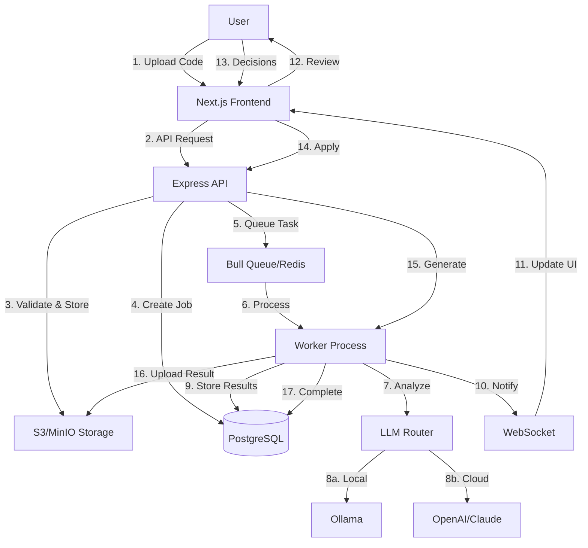

# Data Flow Architecture

## Overview

FinishThisIdea follows a carefully orchestrated data flow that ensures security, scalability, and optimal user experience. This document details how data moves through our system from initial upload to final delivery.

## Table of Contents

- [High-Level Flow](#high-level-flow)
- [Detailed Request Lifecycle](#detailed-request-lifecycle)
- [Data Storage Layers](#data-storage-layers)
- [Processing Pipeline](#processing-pipeline)
- [Real-Time Updates](#real-time-updates)
- [State Management](#state-management)
- [Error Handling Flow](#error-handling-flow)
- [Performance Optimizations](#performance-optimizations)
- [Security Checkpoints](#security-checkpoints)

## High-Level Flow



## Detailed Request Lifecycle

### 1. File Upload Flow

```typescript
// Frontend: Upload initiation
const uploadFlow = {
  step1: "User selects file",
  step2: "Client-side validation (size, type)",
  step3: "Calculate file hash (SHA-256)",
  step4: "Check for duplicates via API",
  step5: "If new, initiate multipart upload",
  step6: "Upload chunks with progress tracking",
  step7: "Server validates and stores in S3",
  step8: "Create upload record in database",
  step9: "Return upload ID to client"
};
```

**Data Transformations:**
```
File (Binary) → Chunks (Binary) → S3 Object → Database Record
```

### 2. Job Creation Flow

```typescript
interface JobCreationFlow {
  // Client request
  request: {
    uploadId: string;
    options: ProcessingOptions;
    userId: string;
  };
  
  // Server processing
  validation: {
    checkUploadExists: boolean;
    checkUserQuota: boolean;
    validateOptions: boolean;
  };
  
  // Database transaction
  transaction: {
    createJob: Job;
    updateUploadStatus: Upload;
    createPaymentIntent: Payment;
  };
  
  // Queue message
  queueMessage: {
    jobId: string;
    priority: number;
    retries: number;
  };
}
```

### 3. Processing Pipeline Flow

```typescript
class ProcessingPipeline {
  stages = [
    {
      name: "Extract",
      input: "S3 archive URL",
      output: "Extracted files array",
      storage: "Temporary filesystem"
    },
    {
      name: "Analyze",
      input: "File array",
      output: "Issues array",
      storage: "Memory"
    },
    {
      name: "Generate",
      input: "Issues array",
      output: "Changes array",
      storage: "Database"
    },
    {
      name: "Review",
      input: "Changes array",
      output: "Decisions array",
      storage: "Database"
    },
    {
      name: "Apply",
      input: "Decisions array",
      output: "Modified files",
      storage: "Temporary filesystem"
    },
    {
      name: "Package",
      input: "Modified files",
      output: "Archive",
      storage: "S3"
    }
  ];
}
```

## Data Storage Layers

### Primary Storage (PostgreSQL)

```sql
-- Core data relationships
Users -> Jobs -> Changes -> Decisions
      -> Uploads -> Files
      -> Payments -> Transactions
      -> SwipePatterns -> Preferences
```

**Write Patterns:**
- User data: Write-once, read-many
- Jobs: Write-heavy during processing
- Changes: Bulk insert, read for review
- Patterns: Incremental updates

**Read Patterns:**
- Dashboard: Aggregated queries
- Job status: Point queries with joins
- History: Paginated time-series

### Object Storage (S3/MinIO)

```yaml
Bucket Structure:
  uploads/
    {userId}/
      {uploadId}/
        original.zip          # Original upload
        extracted/            # Temporary extraction
  
  results/
    {userId}/
      {jobId}/
        processed.zip         # Final result
        report.json          # Processing report
  
  temp/
    {workerId}/
      {jobId}/              # Worker scratch space
```

**Lifecycle Policies:**
- Uploads: Delete after 7 days
- Results: Delete after 30 days
- Temp: Delete after 1 day

### Cache Layer (Redis)

```typescript
interface CacheSchema {
  // Session data
  "session:{sessionId}": UserSession;
  
  // Job status
  "job:{jobId}:status": JobStatus;
  "job:{jobId}:progress": number;
  
  // User quotas
  "user:{userId}:quota": QuotaInfo;
  
  // Rate limiting
  "rate:{userId}:{endpoint}": number;
  
  // Patterns cache
  "patterns:{userId}:{type}": SwipePattern[];
  
  // Active connections
  "ws:{userId}:connections": string[];
}
```

**TTL Strategy:**
- Sessions: 24 hours
- Job status: 1 hour
- Patterns: 7 days
- Rate limits: 1 minute sliding window

## Processing Pipeline

### Worker Process Flow

```typescript
class WorkerDataFlow {
  async processJob(jobId: string) {
    // 1. Claim job (Redis lock)
    const lock = await redisLock(`job:${jobId}:lock`, 300000); // 5 min
    
    // 2. Download from S3 to local
    const localPath = await s3.download(job.uploadS3Key);
    
    // 3. Extract and analyze in memory
    const files = await extract(localPath);
    const issues = await analyze(files);
    
    // 4. Stream to LLM
    const changes = await llmRouter.generateChanges(issues);
    
    // 5. Batch insert to database
    await db.changes.createMany(changes);
    
    // 6. Update job status
    await updateJobStatus(jobId, 'REVIEW');
    
    // 7. Notify via WebSocket
    await notifyClient(job.userId, { jobId, status: 'REVIEW' });
    
    // 8. Release lock
    await lock.release();
  }
}
```

### LLM Router Data Flow

```typescript
interface LLMDataFlow {
  // Input transformation
  input: {
    raw: CodeIssue[];
    normalized: LLMPrompt;
    tokenized: Token[];
  };
  
  // Progressive enhancement
  routing: {
    ollama: {
      attempt: boolean;
      confidence: number;
      result?: LLMResponse;
    };
    openai: {
      attempt: boolean;
      tokens: number;
      cost: number;
      result?: LLMResponse;
    };
    claude: {
      attempt: boolean;
      tokens: number;
      cost: number;
      result?: LLMResponse;
    };
  };
  
  // Output transformation
  output: {
    raw: LLMResponse;
    parsed: ProposedChange[];
    validated: ValidatedChange[];
  };
}
```

## Real-Time Updates

### WebSocket Event Flow

```typescript
// Server -> Client events
interface ServerEvents {
  "job:status": {
    jobId: string;
    status: JobStatus;
    progress?: number;
  };
  
  "job:complete": {
    jobId: string;
    downloadUrl: string;
  };
  
  "job:error": {
    jobId: string;
    error: string;
  };
  
  "changes:ready": {
    jobId: string;
    changeCount: number;
  };
}

// Client -> Server events
interface ClientEvents {
  "subscribe:job": {
    jobId: string;
  };
  
  "decision:submit": {
    jobId: string;
    changeId: string;
    decision: Decision;
  };
}
```

### Event Broadcasting Strategy

```typescript
class EventBroadcaster {
  // Room-based broadcasting
  rooms = {
    user: (userId: string) => `user:${userId}`,
    job: (jobId: string) => `job:${jobId}`,
    global: () => 'global'
  };
  
  // Selective updates
  async notifyJobUpdate(job: Job) {
    // Notify job subscribers
    io.to(this.rooms.job(job.id)).emit('job:status', {
      jobId: job.id,
      status: job.status,
      progress: job.progress
    });
    
    // Notify user
    io.to(this.rooms.user(job.userId)).emit('notification', {
      type: 'job_update',
      jobId: job.id
    });
  }
}
```

## State Management

### Frontend State Synchronization

```typescript
interface AppState {
  // Optimistic updates
  uploads: {
    pending: Upload[];      // Uploading
    completed: Upload[];    // Stored in S3
  };
  
  // Real-time sync
  jobs: {
    active: Job[];         // Via WebSocket
    history: Job[];        // Via API
  };
  
  // Local decisions
  reviews: {
    [jobId: string]: {
      decisions: Decision[];
      pending: boolean;
    };
  };
}
```

### Backend State Consistency

```typescript
class StateManager {
  // Transaction boundaries
  async createJob(data: CreateJobData) {
    return await db.transaction(async (tx) => {
      // 1. Create job
      const job = await tx.job.create(data);
      
      // 2. Update upload status
      await tx.upload.update({
        where: { id: data.uploadId },
        data: { status: 'PROCESSING' }
      });
      
      // 3. Create initial payment record
      await tx.payment.create({
        jobId: job.id,
        amount: calculateCost(data)
      });
      
      return job;
    });
  }
  
  // Distributed locks
  async claimJob(jobId: string, workerId: string) {
    const key = `job:${jobId}:worker`;
    const acquired = await redis.set(key, workerId, 'NX', 'EX', 300);
    return acquired === 'OK';
  }
}
```

## Error Handling Flow

### Graceful Degradation

```typescript
class ErrorFlow {
  // Upload failures
  async handleUploadError(error: Error, context: UploadContext) {
    // 1. Log error with context
    logger.error('Upload failed', { error, ...context });
    
    // 2. Clean up partial upload
    await s3.abortMultipartUpload(context.uploadId);
    
    // 3. Update database
    await db.upload.update({
      where: { id: context.uploadId },
      data: { status: 'FAILED', error: error.message }
    });
    
    // 4. Notify user
    await notifyUser(context.userId, {
      type: 'upload_failed',
      reason: getUserFriendlyError(error)
    });
  }
  
  // Processing failures
  async handleProcessingError(error: Error, job: Job) {
    // 1. Categorize error
    const category = categorizeError(error);
    
    // 2. Decide on retry
    if (category === 'transient' && job.attempts < 3) {
      // Requeue with backoff
      await queue.add('retry-job', { jobId: job.id }, {
        delay: Math.pow(2, job.attempts) * 1000
      });
    } else {
      // Mark as failed
      await markJobFailed(job.id, error);
      
      // Refund if applicable
      if (job.payment?.status === 'SUCCEEDED') {
        await processRefund(job.payment.id);
      }
    }
  }
}
```

### Circuit Breaker Pattern

```typescript
class LLMCircuitBreaker {
  private failures = new Map<string, number>();
  private lastFailure = new Map<string, Date>();
  
  async callWithBreaker(provider: string, fn: Function) {
    // Check if circuit is open
    if (this.isOpen(provider)) {
      throw new Error(`${provider} circuit breaker is open`);
    }
    
    try {
      const result = await fn();
      this.onSuccess(provider);
      return result;
    } catch (error) {
      this.onFailure(provider);
      throw error;
    }
  }
  
  private isOpen(provider: string): boolean {
    const failures = this.failures.get(provider) || 0;
    const lastFailure = this.lastFailure.get(provider);
    
    // Circuit opens after 5 failures in 1 minute
    if (failures >= 5 && lastFailure) {
      const timeSinceFailure = Date.now() - lastFailure.getTime();
      return timeSinceFailure < 60000; // 1 minute
    }
    
    return false;
  }
}
```

## Performance Optimizations

### Data Pipeline Optimizations

```typescript
class OptimizedPipeline {
  // Streaming processing
  async processLargeFile(filePath: string) {
    const stream = fs.createReadStream(filePath);
    const analyzer = new StreamAnalyzer();
    
    return new Promise((resolve, reject) => {
      stream
        .pipe(analyzer)
        .on('data', (issue) => {
          // Process issues as they're found
          this.queueIssue(issue);
        })
        .on('end', () => resolve(analyzer.getSummary()))
        .on('error', reject);
    });
  }
  
  // Batch operations
  async batchInsertChanges(changes: Change[]) {
    const BATCH_SIZE = 1000;
    const batches = chunk(changes, BATCH_SIZE);
    
    await Promise.all(
      batches.map(batch => 
        db.change.createMany({ data: batch })
      )
    );
  }
  
  // Parallel processing
  async analyzeFiles(files: File[]) {
    const CONCURRENCY = 5;
    const results = [];
    
    for (let i = 0; i < files.length; i += CONCURRENCY) {
      const batch = files.slice(i, i + CONCURRENCY);
      const batchResults = await Promise.all(
        batch.map(file => this.analyzeFile(file))
      );
      results.push(...batchResults);
    }
    
    return results;
  }
}
```

### Caching Strategy

```typescript
class CacheOptimization {
  // Multi-level caching
  async getPattern(userId: string, type: string) {
    // L1: Memory cache (fastest)
    const memoryCache = this.memory.get(`${userId}:${type}`);
    if (memoryCache) return memoryCache;
    
    // L2: Redis cache (fast)
    const redisCache = await redis.get(`patterns:${userId}:${type}`);
    if (redisCache) {
      const parsed = JSON.parse(redisCache);
      this.memory.set(`${userId}:${type}`, parsed);
      return parsed;
    }
    
    // L3: Database (slow)
    const dbResult = await db.swipePattern.findMany({
      where: { userId, changeType: type }
    });
    
    // Populate caches
    await redis.setex(
      `patterns:${userId}:${type}`,
      3600,
      JSON.stringify(dbResult)
    );
    this.memory.set(`${userId}:${type}`, dbResult);
    
    return dbResult;
  }
}
```

## Security Checkpoints

### Data Validation Points

```typescript
class SecurityCheckpoints {
  // Input validation
  validateUpload(file: Express.Multer.File) {
    // 1. File type check
    if (!ALLOWED_MIME_TYPES.includes(file.mimetype)) {
      throw new ValidationError('Invalid file type');
    }
    
    // 2. Size check
    if (file.size > MAX_FILE_SIZE) {
      throw new ValidationError('File too large');
    }
    
    // 3. Malware scan
    const scanResult = await malwareScanner.scan(file.buffer);
    if (!scanResult.clean) {
      throw new SecurityError('Malware detected');
    }
    
    // 4. Archive bomb check
    const entries = await countArchiveEntries(file.buffer);
    if (entries > MAX_ARCHIVE_ENTRIES) {
      throw new SecurityError('Archive bomb detected');
    }
  }
  
  // Output sanitization
  sanitizeChanges(changes: Change[]) {
    return changes.map(change => ({
      ...change,
      // Remove any injected scripts
      after: sanitizeCode(change.after),
      // Escape special characters
      description: escapeHtml(change.description)
    }));
  }
}
```

### Access Control Flow

```typescript
interface AccessControl {
  // Resource-based permissions
  canAccessJob(userId: string, jobId: string): Promise<boolean>;
  canAccessUpload(userId: string, uploadId: string): Promise<boolean>;
  
  // Rate limiting
  checkRateLimit(userId: string, action: string): Promise<void>;
  
  // Quota enforcement
  checkQuota(userId: string, resource: string): Promise<void>;
}
```

## Related Documentation

- [System Design](system-design.md) - Overall architecture
- [Security Model](security-model.md) - Security details
- [API Reference](../06-api/README.md) - API endpoints
- [WebSocket Events](../06-api/websocket-api.md) - Real-time events

---

*Last Updated: 2024-01-20*