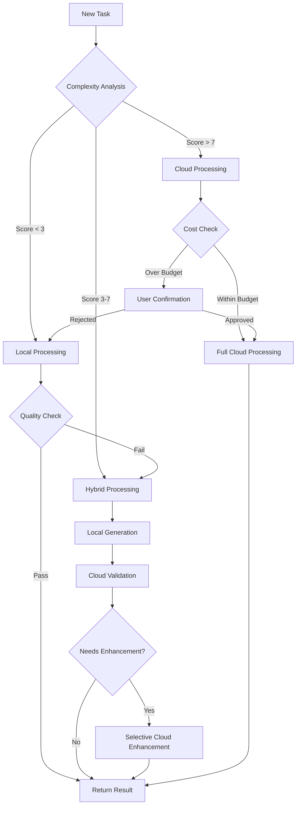

# LLM Routing Architecture

## Overview

The LLM routing system is the heart of FinishThisIdea's cost optimization strategy. It intelligently routes tasks between local (free) and cloud (paid) language models based on complexity, quality requirements, and user preferences.

## Core Principles

### 1. **Progressive Enhancement**
Start with the cheapest option (Ollama) and only escalate to paid services when necessary.

### 2. **Quality Assurance**
Never sacrifice output quality for cost savings - use confidence scoring to ensure standards.

### 3. **User Control**
Always give users the option to upgrade results or stick with local processing.

## Architecture Components

### Complexity Analyzer

```javascript
class ComplexityAnalyzer {
  constructor() {
    this.metrics = {
      fileCount: { weight: 0.1, threshold: 100 },
      totalLines: { weight: 0.2, threshold: 10000 },
      languages: { weight: 0.15, threshold: 3 },
      frameworks: { weight: 0.2, threshold: 2 },
      dependencies: { weight: 0.15, threshold: 50 },
      nestedDepth: { weight: 0.2, threshold: 5 }
    };
  }

  async analyze(codebase) {
    const scores = {
      fileCount: this.normalizeScore(codebase.files.length, this.metrics.fileCount.threshold),
      totalLines: this.normalizeScore(codebase.totalLines, this.metrics.totalLines.threshold),
      languages: this.normalizeScore(codebase.languages.length, this.metrics.languages.threshold),
      frameworks: this.normalizeScore(codebase.frameworks.length, this.metrics.frameworks.threshold),
      dependencies: this.normalizeScore(codebase.dependencies.length, this.metrics.dependencies.threshold),
      nestedDepth: this.normalizeScore(codebase.maxDepth, this.metrics.nestedDepth.threshold)
    };

    const complexityScore = Object.entries(scores).reduce((total, [key, score]) => {
      return total + (score * this.metrics[key].weight);
    }, 0);

    return {
      score: complexityScore * 10, // Scale to 0-10
      breakdown: scores,
      recommendation: this.getRecommendation(complexityScore)
    };
  }

  normalizeScore(value, threshold) {
    return Math.min(value / threshold, 1);
  }

  getRecommendation(score) {
    if (score < 3) return 'local';
    if (score < 7) return 'hybrid';
    return 'cloud';
  }
}
```

### LLM Router

```javascript
class LLMRouter {
  constructor() {
    this.providers = {
      local: new OllamaProvider({
        models: {
          'code-analysis': 'codellama:13b',
          'code-generation': 'codellama:34b',
          'documentation': 'mistral:7b',
          'general': 'llama2:13b'
        }
      }),
      openai: new OpenAIProvider({
        models: {
          'code-analysis': 'gpt-4-turbo',
          'code-generation': 'gpt-4',
          'documentation': 'gpt-3.5-turbo',
          'general': 'gpt-3.5-turbo'
        }
      }),
      anthropic: new AnthropicProvider({
        models: {
          'code-analysis': 'claude-3-opus',
          'code-generation': 'claude-3-sonnet',
          'documentation': 'claude-3-haiku',
          'general': 'claude-3-haiku'
        }
      })
    };

    this.costModel = {
      local: { perToken: 0, fixedCost: 0, quality: 0.7 },
      openai: { perToken: 0.00002, fixedCost: 0.01, quality: 0.9 },
      anthropic: { perToken: 0.00003, fixedCost: 0.015, quality: 0.95 }
    };
  }

  async route(task, options = {}) {
    const { 
      forceProvider = null,
      maxCost = 0.50,
      minQuality = 0.8,
      userPreferences = {}
    } = options;

    // Step 1: Analyze task complexity
    const complexity = await this.analyzeComplexity(task);
    
    // Step 2: Check user preferences
    if (userPreferences.alwaysLocal && complexity.score < 8) {
      return this.processWithProvider('local', task);
    }

    // Step 3: Try local first for simple tasks
    if (complexity.score < 3) {
      const localResult = await this.processWithProvider('local', task);
      if (localResult.confidence > 0.85) {
        return localResult;
      }
    }

    // Step 4: Hybrid approach for medium complexity
    if (complexity.score < 7) {
      return this.hybridProcessing(task, complexity);
    }

    // Step 5: Cloud for complex tasks
    return this.cloudProcessing(task, maxCost);
  }

  async hybridProcessing(task, complexity) {
    // Generate with local model
    const localResult = await this.processWithProvider('local', task);
    
    // Validate and enhance with cloud if needed
    const validation = await this.validateResult(localResult, task);
    
    if (validation.isValid && validation.confidence > 0.8) {
      return localResult;
    }

    // Enhance specific parts with cloud
    const enhancement = await this.enhanceWithCloud(localResult, validation.issues);
    return this.mergeResults(localResult, enhancement);
  }

  async cloudProcessing(task, maxCost) {
    const costEstimate = await this.estimateCost(task);
    
    if (costEstimate.anthropic <= maxCost) {
      return this.processWithProvider('anthropic', task);
    } else if (costEstimate.openai <= maxCost) {
      return this.processWithProvider('openai', task);
    } else {
      // Fallback to local with warning
      const result = await this.processWithProvider('local', task);
      result.warning = 'Processed locally due to cost constraints';
      return result;
    }
  }
}
```

### Cost Optimization Engine

```javascript
class CostOptimizer {
  constructor() {
    this.cache = new Map();
    this.patterns = new Map();
  }

  async optimizeRequest(task) {
    // Check cache first
    const cacheKey = this.generateCacheKey(task);
    if (this.cache.has(cacheKey)) {
      return this.cache.get(cacheKey);
    }

    // Check for similar patterns
    const pattern = this.findSimilarPattern(task);
    if (pattern) {
      return this.applyPattern(pattern, task);
    }

    // Optimize token usage
    const optimizedPrompt = await this.optimizePrompt(task.prompt);
    
    return {
      ...task,
      prompt: optimizedPrompt,
      estimatedTokens: this.countTokens(optimizedPrompt)
    };
  }

  optimizePrompt(prompt) {
    // Remove redundant instructions
    let optimized = prompt
      .replace(/please|kindly|could you/gi, '')
      .replace(/\s+/g, ' ')
      .trim();

    // Use compression techniques
    const compressed = this.compressInstructions(optimized);
    
    return compressed;
  }

  compressInstructions(text) {
    const compressionMap = {
      'analyze the code and': 'analyze:',
      'generate documentation for': 'document:',
      'refactor the following': 'refactor:',
      'create tests for': 'test:'
    };

    let compressed = text;
    for (const [long, short] of Object.entries(compressionMap)) {
      compressed = compressed.replace(new RegExp(long, 'gi'), short);
    }

    return compressed;
  }
}
```

## Routing Decision Flow



## Model Selection Strategy

### Local Models (Ollama)

```javascript
const localModels = {
  'codellama:7b': {
    use: 'Quick code analysis and simple refactoring',
    speed: 'fast',
    quality: 'good',
    memory: '8GB'
  },
  'codellama:13b': {
    use: 'Comprehensive code analysis and generation',
    speed: 'medium',
    quality: 'very good',
    memory: '16GB'
  },
  'codellama:34b': {
    use: 'Complex code generation and architectural decisions',
    speed: 'slow',
    quality: 'excellent',
    memory: '32GB'
  },
  'mistral:7b': {
    use: 'Documentation and general text processing',
    speed: 'fast',
    quality: 'good',
    memory: '8GB'
  },
  'phi-2': {
    use: 'Ultra-fast responses for simple tasks',
    speed: 'very fast',
    quality: 'adequate',
    memory: '4GB'
  }
};
```

### Cloud Model Selection

```javascript
const cloudModelSelection = {
  'simple-refactor': 'gpt-3.5-turbo',
  'complex-refactor': 'gpt-4-turbo',
  'architecture-design': 'claude-3-opus',
  'documentation': 'claude-3-haiku',
  'code-review': 'gpt-4',
  'test-generation': 'claude-3-sonnet'
};
```

## Quality Assurance

### Confidence Scoring

```javascript
class QualityAssurance {
  async scoreResult(result, task) {
    const scores = {
      syntaxCorrectness: await this.checkSyntax(result),
      completeness: await this.checkCompleteness(result, task),
      consistency: await this.checkConsistency(result),
      bestPractices: await this.checkBestPractices(result)
    };

    const weights = {
      syntaxCorrectness: 0.4,
      completeness: 0.3,
      consistency: 0.2,
      bestPractices: 0.1
    };

    const confidence = Object.entries(scores).reduce((total, [key, score]) => {
      return total + (score * weights[key]);
    }, 0);

    return {
      confidence,
      scores,
      needsEnhancement: confidence < 0.8,
      enhancementAreas: this.identifyWeakAreas(scores)
    };
  }
}
```

## Cost Tracking

### Real-time Cost Monitoring

```javascript
class CostTracker {
  constructor() {
    this.dailyBudget = 50; // $50 per day
    this.spent = 0;
    this.projections = {};
  }

  async trackUsage(provider, tokens, cost) {
    const usage = {
      provider,
      tokens,
      cost,
      timestamp: new Date()
    };

    await this.db.insert('usage_logs', usage);
    this.spent += cost;

    // Alert if approaching budget
    if (this.spent > this.dailyBudget * 0.8) {
      await this.notifyBudgetWarning();
    }

    return {
      dailySpent: this.spent,
      remainingBudget: this.dailyBudget - this.spent,
      projectedMonthly: this.projectMonthlySpend()
    };
  }

  projectMonthlySpend() {
    const hoursSinceStart = (Date.now() - this.dayStart) / (1000 * 60 * 60);
    const hourlyRate = this.spent / hoursSinceStart;
    return hourlyRate * 24 * 30; // Project to monthly
  }
}
```

## Performance Optimization

### Request Batching

```javascript
class RequestBatcher {
  constructor() {
    this.queues = new Map();
    this.batchSize = 10;
    this.batchTimeout = 1000; // 1 second
  }

  async addRequest(provider, request) {
    if (!this.queues.has(provider)) {
      this.queues.set(provider, []);
    }

    const queue = this.queues.get(provider);
    queue.push(request);

    if (queue.length >= this.batchSize) {
      return this.processBatch(provider);
    }

    // Set timeout for partial batch
    if (queue.length === 1) {
      setTimeout(() => this.processBatch(provider), this.batchTimeout);
    }

    return request.promise;
  }

  async processBatch(provider) {
    const queue = this.queues.get(provider) || [];
    this.queues.set(provider, []);

    if (queue.length === 0) return;

    const batchRequest = this.combineBatchRequests(queue);
    const batchResult = await this.providers[provider].processBatch(batchRequest);
    
    this.distributeBatchResults(queue, batchResult);
  }
}
```

## Fallback Strategies

### Provider Failover

```javascript
const fallbackChain = [
  { provider: 'anthropic', maxRetries: 2 },
  { provider: 'openai', maxRetries: 2 },
  { provider: 'local', maxRetries: 3 }
];

async function processWithFallback(task) {
  for (const { provider, maxRetries } of fallbackChain) {
    try {
      return await retryWithBackoff(
        () => providers[provider].process(task),
        maxRetries
      );
    } catch (error) {
      console.error(`Provider ${provider} failed:`, error);
      continue;
    }
  }
  
  throw new Error('All providers failed');
}
```

This architecture ensures that FinishThisIdea can provide high-quality results while optimizing costs through intelligent routing between local and cloud language models.