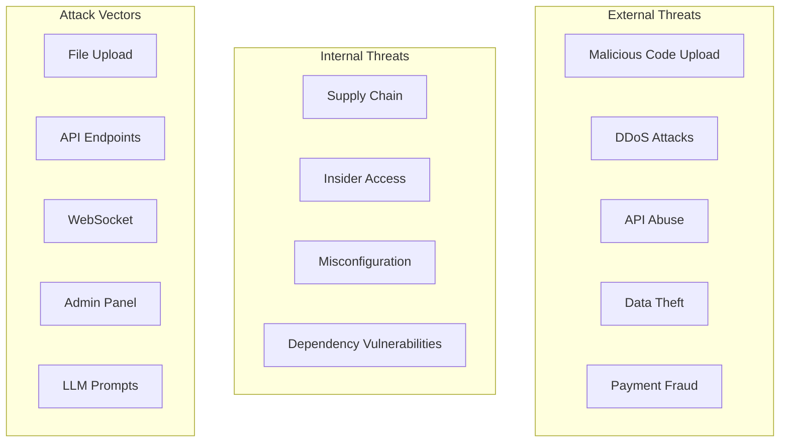

# Security Model

## Overview

FinishThisIdea implements defense-in-depth security with multiple layers protecting user code, data, and infrastructure. This document details our comprehensive security architecture and practices.

## Table of Contents

- [Security Principles](#security-principles)
- [Threat Model](#threat-model)
- [Authentication & Authorization](#authentication--authorization)
- [Data Security](#data-security)
- [Code Security](#code-security)
- [Infrastructure Security](#infrastructure-security)
- [API Security](#api-security)
- [Payment Security](#payment-security)
- [Compliance & Privacy](#compliance--privacy)
- [Security Monitoring](#security-monitoring)
- [Incident Response](#incident-response)

## Security Principles

### Core Principles

1. **Zero Trust Architecture**
   - Never trust, always verify
   - Assume breach mentality
   - Least privilege access

2. **Defense in Depth**
   - Multiple security layers
   - No single point of failure
   - Redundant controls

3. **Privacy by Design**
   - Minimal data collection
   - Data encryption everywhere
   - User control over data

4. **Security as Code**
   - Automated security testing
   - Infrastructure as code
   - Version-controlled policies

## Threat Model

### Identified Threats



### Risk Matrix

| Threat | Likelihood | Impact | Risk Level | Mitigation |
|--------|------------|--------|------------|-----------|
| Malicious Code Upload | High | High | Critical | Sandboxing, scanning |
| API Abuse | High | Medium | High | Rate limiting, auth |
| Data Theft | Medium | High | High | Encryption, access control |
| DDoS | Medium | Medium | Medium | CDN, rate limiting |
| LLM Prompt Injection | Medium | Low | Low | Input validation |

## Authentication & Authorization

### JWT Authentication

```typescript
interface JWTPayload {
  sub: string;          // User ID
  email: string;        // User email
  roles: string[];      // User roles
  exp: number;          // Expiration
  iat: number;          // Issued at
  jti: string;          // JWT ID for revocation
}

// Token generation
function generateTokens(user: User) {
  const accessToken = jwt.sign(
    {
      sub: user.id,
      email: user.email,
      roles: user.roles,
      jti: generateTokenId()
    },
    process.env.JWT_SECRET,
    { expiresIn: '15m' }
  );
  
  const refreshToken = jwt.sign(
    { sub: user.id, jti: generateTokenId() },
    process.env.JWT_REFRESH_SECRET,
    { expiresIn: '7d' }
  );
  
  return { accessToken, refreshToken };
}
```

### Role-Based Access Control (RBAC)

```typescript
const permissions = {
  'user': [
    'upload:create',
    'job:create',
    'job:read:own',
    'payment:create:own'
  ],
  'premium': [
    ...permissions.user,
    'job:priority',
    'template:premium'
  ],
  'admin': [
    '*:*'  // All permissions
  ]
};

// Middleware
function authorize(resource: string, action: string) {
  return (req: Request, res: Response, next: NextFunction) => {
    const userPerms = permissions[req.user.role] || [];
    const required = `${resource}:${action}`;
    
    if (userPerms.includes(required) || userPerms.includes('*:*')) {
      return next();
    }
    
    res.status(403).json({ error: 'Forbidden' });
  };
}
```

### OAuth 2.0 Integration

```typescript
// OAuth providers configuration
const oauthProviders = {
  google: {
    clientId: process.env.GOOGLE_CLIENT_ID,
    clientSecret: process.env.GOOGLE_CLIENT_SECRET,
    scope: ['email', 'profile'],
    callbackURL: '/auth/google/callback'
  },
  github: {
    clientId: process.env.GITHUB_CLIENT_ID,
    clientSecret: process.env.GITHUB_CLIENT_SECRET,
    scope: ['user:email'],
    callbackURL: '/auth/github/callback'
  }
};
```

## Data Security

### Encryption at Rest

```typescript
// Database field encryption
class EncryptedField {
  private algorithm = 'aes-256-gcm';
  private key: Buffer;
  
  constructor() {
    this.key = Buffer.from(process.env.ENCRYPTION_KEY, 'hex');
  }
  
  encrypt(text: string): EncryptedData {
    const iv = crypto.randomBytes(16);
    const cipher = crypto.createCipheriv(this.algorithm, this.key, iv);
    
    const encrypted = Buffer.concat([
      cipher.update(text, 'utf8'),
      cipher.final()
    ]);
    
    const authTag = cipher.getAuthTag();
    
    return {
      encrypted: encrypted.toString('hex'),
      iv: iv.toString('hex'),
      authTag: authTag.toString('hex')
    };
  }
  
  decrypt(data: EncryptedData): string {
    const decipher = crypto.createDecipheriv(
      this.algorithm,
      this.key,
      Buffer.from(data.iv, 'hex')
    );
    
    decipher.setAuthTag(Buffer.from(data.authTag, 'hex'));
    
    return decipher.update(data.encrypted, 'hex', 'utf8') + 
           decipher.final('utf8');
  }
}
```

### S3 Object Encryption

```typescript
// S3 upload with encryption
async function uploadSecure(file: Buffer, key: string) {
  const encryptedFile = await encrypt(file);
  
  return s3.putObject({
    Bucket: process.env.S3_BUCKET,
    Key: key,
    Body: encryptedFile,
    ServerSideEncryption: 'AES256',
    SSEKMSKeyId: process.env.KMS_KEY_ID,
    Metadata: {
      'x-amz-meta-encrypted': 'true',
      'x-amz-meta-algorithm': 'aes-256-gcm'
    }
  }).promise();
}
```

### Data Retention & Deletion

```typescript
class DataRetention {
  // Automatic deletion after retention period
  async enforceRetention() {
    // Delete old uploads
    await db.upload.deleteMany({
      where: {
        createdAt: {
          lt: new Date(Date.now() - 7 * 24 * 60 * 60 * 1000) // 7 days
        },
        status: 'COMPLETED'
      }
    });
    
    // Delete S3 objects
    const oldObjects = await s3.listObjectsV2({
      Bucket: process.env.S3_BUCKET,
      Prefix: 'uploads/',
      StartAfter: getRetentionDate()
    }).promise();
    
    if (oldObjects.Contents?.length) {
      await s3.deleteObjects({
        Bucket: process.env.S3_BUCKET,
        Delete: {
          Objects: oldObjects.Contents.map(obj => ({ Key: obj.Key }))
        }
      }).promise();
    }
  }
}
```

## Code Security

### Malicious Code Detection

```typescript
class CodeScanner {
  private patterns = [
    // Suspicious patterns
    /eval\s*\(/gi,
    /new\s+Function\s*\(/gi,
    /\.innerHTML\s*=/gi,
    /document\.write/gi,
    
    // Network access
    /fetch\s*\(/gi,
    /XMLHttpRequest/gi,
    /\.createServer/gi,
    
    // File system access
    /require\s*\(['"]fs['"]\)/gi,
    /import\s+.*\s+from\s+['"]fs['"]|/gi,
    
    // Process/system access
    /process\.env/gi,
    /child_process/gi,
    /exec\s*\(/gi
  ];
  
  async scan(code: string): Promise<ScanResult> {
    const issues: SecurityIssue[] = [];
    
    // Pattern matching
    for (const pattern of this.patterns) {
      const matches = code.matchAll(pattern);
      for (const match of matches) {
        issues.push({
          type: 'suspicious_pattern',
          pattern: pattern.source,
          location: match.index,
          severity: 'medium'
        });
      }
    }
    
    // Additional checks
    if (await this.checkForMalware(code)) {
      issues.push({
        type: 'malware_detected',
        severity: 'critical'
      });
    }
    
    return {
      safe: issues.length === 0,
      issues
    };
  }
}
```

### Sandbox Execution

```typescript
// Docker-based sandboxing
class CodeSandbox {
  async execute(code: string, language: string): Promise<ExecutionResult> {
    const container = await docker.createContainer({
      Image: `sandbox-${language}:latest`,
      Cmd: ['execute', code],
      HostConfig: {
        Memory: 512 * 1024 * 1024,        // 512MB limit
        CpuShares: 512,                   // CPU limit
        NetworkMode: 'none',              // No network
        ReadonlyRootfs: true,             // Read-only filesystem
        SecurityOpt: ['no-new-privileges'],
        CapDrop: ['ALL']                  // Drop all capabilities
      },
      WorkingDir: '/sandbox',
      User: 'sandbox:sandbox',
      AttachStdout: true,
      AttachStderr: true
    });
    
    // Set timeout
    const timeout = setTimeout(() => {
      container.kill();
    }, 5000); // 5 second timeout
    
    try {
      await container.start();
      const stream = await container.attach({ stream: true, stdout: true, stderr: true });
      const output = await streamToString(stream);
      clearTimeout(timeout);
      
      return { success: true, output };
    } finally {
      await container.remove();
    }
  }
}
```

### Archive Bomb Protection

```typescript
class ArchiveValidator {
  private readonly MAX_FILES = 10000;
  private readonly MAX_SIZE = 500 * 1024 * 1024; // 500MB uncompressed
  private readonly MAX_RATIO = 100; // Max compression ratio
  
  async validate(archive: Buffer): Promise<ValidationResult> {
    const compressedSize = archive.length;
    let uncompressedSize = 0;
    let fileCount = 0;
    
    // Stream through archive
    const stream = new ZipStream(archive);
    
    for await (const entry of stream) {
      fileCount++;
      uncompressedSize += entry.uncompressedSize;
      
      // Check limits
      if (fileCount > this.MAX_FILES) {
        throw new SecurityError('Too many files in archive');
      }
      
      if (uncompressedSize > this.MAX_SIZE) {
        throw new SecurityError('Archive too large when extracted');
      }
      
      const ratio = uncompressedSize / compressedSize;
      if (ratio > this.MAX_RATIO) {
        throw new SecurityError('Suspicious compression ratio');
      }
    }
    
    return { valid: true, fileCount, uncompressedSize };
  }
}
```

## Infrastructure Security

### Network Security

```yaml
# Kubernetes NetworkPolicy
apiVersion: networking.k8s.io/v1
kind: NetworkPolicy
metadata:
  name: api-network-policy
spec:
  podSelector:
    matchLabels:
      app: api
  policyTypes:
  - Ingress
  - Egress
  ingress:
  - from:
    - podSelector:
        matchLabels:
          app: nginx
    ports:
    - protocol: TCP
      port: 3000
  egress:
  - to:
    - podSelector:
        matchLabels:
          app: postgres
    ports:
    - protocol: TCP
      port: 5432
  - to:
    - podSelector:
        matchLabels:
          app: redis
    ports:
    - protocol: TCP
      port: 6379
```

### Secrets Management

```typescript
// HashiCorp Vault integration
class SecretManager {
  private vault: Vault;
  
  constructor() {
    this.vault = new Vault({
      endpoint: process.env.VAULT_ADDR,
      token: process.env.VAULT_TOKEN
    });
  }
  
  async getSecret(path: string): Promise<string> {
    const response = await this.vault.read(`secret/data/${path}`);
    return response.data.data.value;
  }
  
  async rotateSecrets() {
    // Database credentials
    const newDbPassword = generateSecurePassword();
    await this.vault.write('secret/data/database', {
      data: { password: newDbPassword }
    });
    
    // Update database
    await db.$executeRaw`
      ALTER USER ${process.env.DB_USER} 
      WITH PASSWORD ${newDbPassword}
    `;
    
    // API keys
    const newApiKey = generateApiKey();
    await this.vault.write('secret/data/api', {
      data: { key: newApiKey }
    });
  }
}
```

### Container Security

```dockerfile
# Secure Dockerfile
FROM node:18-alpine AS base

# Create non-root user
RUN addgroup -g 1001 -S nodejs
RUN adduser -S nodejs -u 1001

# Install security updates
RUN apk update && apk upgrade

# Production stage
FROM base AS production

# Set working directory
WORKDIR /app

# Copy package files
COPY --chown=nodejs:nodejs package*.json ./

# Install production dependencies only
RUN npm ci --only=production && npm cache clean --force

# Copy application
COPY --chown=nodejs:nodejs . .

# Security headers
ENV NODE_ENV=production
ENV NODE_OPTIONS="--max-old-space-size=512"

# Run as non-root
USER nodejs

# Health check
HEALTHCHECK --interval=30s --timeout=3s --start-period=60s --retries=3 \
  CMD node healthcheck.js

EXPOSE 3000
CMD ["node", "dist/index.js"]
```

## API Security

### Rate Limiting

```typescript
const rateLimiters = {
  // Global rate limit
  global: rateLimit({
    windowMs: 15 * 60 * 1000, // 15 minutes
    max: 100,
    message: 'Too many requests',
    standardHeaders: true,
    legacyHeaders: false,
  }),
  
  // Strict limit for uploads
  upload: rateLimit({
    windowMs: 60 * 60 * 1000, // 1 hour
    max: 10,
    skipSuccessfulRequests: false,
    keyGenerator: (req) => req.user?.id || req.ip
  }),
  
  // Auth endpoints
  auth: rateLimit({
    windowMs: 15 * 60 * 1000,
    max: 5,
    skipFailedRequests: false
  })
};

// Apply rate limiting
app.use('/api/', rateLimiters.global);
app.use('/api/upload', rateLimiters.upload);
app.use('/api/auth', rateLimiters.auth);
```

### Input Validation

```typescript
// Zod schemas for validation
const uploadSchema = z.object({
  file: z.instanceof(Buffer)
    .refine(buf => buf.length <= 50 * 1024 * 1024, 'File too large'),
  options: z.object({
    removeComments: z.boolean().default(false),
    generateDocs: z.boolean().default(true),
    strictMode: z.boolean().default(false)
  }).strict()
});

// Validation middleware
function validate(schema: ZodSchema) {
  return async (req: Request, res: Response, next: NextFunction) => {
    try {
      const validated = await schema.parseAsync(req.body);
      req.body = validated;
      next();
    } catch (error) {
      if (error instanceof z.ZodError) {
        res.status(400).json({
          error: 'Validation failed',
          details: error.errors
        });
      } else {
        next(error);
      }
    }
  };
}
```

### CORS Configuration

```typescript
const corsOptions: cors.CorsOptions = {
  origin: (origin, callback) => {
    const allowedOrigins = [
      'https://finishthisidea.com',
      'https://app.finishthisidea.com'
    ];
    
    // Allow requests with no origin (mobile apps, Postman)
    if (!origin) return callback(null, true);
    
    if (allowedOrigins.includes(origin)) {
      callback(null, true);
    } else {
      callback(new Error('Not allowed by CORS'));
    }
  },
  credentials: true,
  methods: ['GET', 'POST', 'PUT', 'DELETE'],
  allowedHeaders: ['Content-Type', 'Authorization'],
  maxAge: 86400 // 24 hours
};

app.use(cors(corsOptions));
```

## Payment Security

### PCI Compliance

```typescript
// Never store card details - use Stripe tokens
class PaymentProcessor {
  private stripe: Stripe;
  
  constructor() {
    this.stripe = new Stripe(process.env.STRIPE_SECRET_KEY, {
      apiVersion: '2023-10-16'
    });
  }
  
  async createPayment(amount: number, token: string, userId: string) {
    // Create payment intent
    const intent = await this.stripe.paymentIntents.create({
      amount: amount * 100, // Convert to cents
      currency: 'usd',
      payment_method: token,
      confirm: true,
      metadata: {
        userId,
        timestamp: Date.now().toString()
      },
      statement_descriptor: 'FINISHTHISIDEA',
    });
    
    // Log transaction (no card details)
    await db.payment.create({
      data: {
        userId,
        amount,
        stripeIntentId: intent.id,
        status: intent.status,
        last4: intent.payment_method?.card?.last4 || 'N/A'
      }
    });
    
    return intent;
  }
}
```

### Webhook Security

```typescript
// Stripe webhook validation
app.post('/webhooks/stripe', 
  express.raw({ type: 'application/json' }),
  async (req, res) => {
    const sig = req.headers['stripe-signature'] as string;
    
    try {
      const event = stripe.webhooks.constructEvent(
        req.body,
        sig,
        process.env.STRIPE_WEBHOOK_SECRET
      );
      
      // Process webhook
      await processStripeWebhook(event);
      
      res.json({ received: true });
    } catch (err) {
      console.error('Webhook signature verification failed');
      res.status(400).send('Webhook Error');
    }
  }
);
```

## Compliance & Privacy

### GDPR Compliance

```typescript
class PrivacyController {
  // Data export
  async exportUserData(userId: string) {
    const data = {
      profile: await db.user.findUnique({ where: { id: userId } }),
      uploads: await db.upload.findMany({ where: { userId } }),
      jobs: await db.job.findMany({ where: { userId } }),
      payments: await db.payment.findMany({ where: { userId } })
    };
    
    return this.sanitizeForExport(data);
  }
  
  // Data deletion
  async deleteUserData(userId: string) {
    // Start transaction
    await db.$transaction(async (tx) => {
      // Delete S3 objects
      const uploads = await tx.upload.findMany({ where: { userId } });
      for (const upload of uploads) {
        await s3.deleteObject({
          Bucket: process.env.S3_BUCKET,
          Key: upload.s3Key
        }).promise();
      }
      
      // Delete database records
      await tx.change.deleteMany({ where: { job: { userId } } });
      await tx.job.deleteMany({ where: { userId } });
      await tx.upload.deleteMany({ where: { userId } });
      await tx.payment.deleteMany({ where: { userId } });
      await tx.user.delete({ where: { id: userId } });
    });
  }
}
```

### Privacy Policy Implementation

```typescript
interface PrivacySettings {
  analytics: boolean;
  marketing: boolean;
  dataSharing: boolean;
}

// User consent tracking
class ConsentManager {
  async updateConsent(userId: string, settings: PrivacySettings) {
    await db.userConsent.upsert({
      where: { userId },
      create: {
        userId,
        ...settings,
        consentedAt: new Date()
      },
      update: {
        ...settings,
        updatedAt: new Date()
      }
    });
  }
  
  async checkConsent(userId: string, type: keyof PrivacySettings) {
    const consent = await db.userConsent.findUnique({
      where: { userId }
    });
    
    return consent?.[type] ?? false;
  }
}
```

## Security Monitoring

### Logging Strategy

```typescript
// Security event logger
class SecurityLogger {
  private logger: winston.Logger;
  
  constructor() {
    this.logger = winston.createLogger({
      level: 'info',
      format: winston.format.json(),
      transports: [
        new winston.transports.File({ 
          filename: 'security.log',
          level: 'warning' 
        }),
        new winston.transports.Console({
          format: winston.format.simple()
        })
      ]
    });
  }
  
  logSecurityEvent(event: SecurityEvent) {
    this.logger.warn('Security Event', {
      timestamp: new Date().toISOString(),
      type: event.type,
      userId: event.userId,
      ip: event.ip,
      details: event.details,
      severity: event.severity
    });
    
    // Alert on critical events
    if (event.severity === 'critical') {
      this.sendAlert(event);
    }
  }
}
```

### Intrusion Detection

```typescript
class IntrusionDetector {
  private patterns = {
    sqlInjection: /('|(\-\-)|(;)|(\|\|)|(\*)).*?(SELECT|INSERT|UPDATE|DELETE|DROP)/i,
    xss: /<script[^>]*>.*?<\/script>/gi,
    pathTraversal: /\.\.[\\/]/,
    commandInjection: /(;|\||&|\$|\(|\)|`|\n)/
  };
  
  async detectAttack(request: Request): Promise<AttackDetection> {
    const suspicious = [];
    
    // Check all input sources
    const inputs = [
      ...Object.values(request.body || {}),
      ...Object.values(request.query || {}),
      ...Object.values(request.params || {})
    ];
    
    for (const input of inputs) {
      if (typeof input !== 'string') continue;
      
      for (const [type, pattern] of Object.entries(this.patterns)) {
        if (pattern.test(input)) {
          suspicious.push({ type, input, pattern: pattern.source });
        }
      }
    }
    
    if (suspicious.length > 0) {
      await this.logAttack(request, suspicious);
      return { detected: true, attacks: suspicious };
    }
    
    return { detected: false };
  }
}
```

## Incident Response

### Response Plan

```typescript
class IncidentResponse {
  async handleIncident(incident: SecurityIncident) {
    const response = {
      id: generateIncidentId(),
      startTime: new Date(),
      actions: [] as string[]
    };
    
    switch (incident.severity) {
      case 'critical':
        // Immediate actions
        response.actions.push('Block attacker IP');
        await this.blockIP(incident.sourceIP);
        
        response.actions.push('Alert security team');
        await this.alertTeam(incident);
        
        response.actions.push('Enable emergency mode');
        await this.enableEmergencyMode();
        break;
        
      case 'high':
        // Elevated response
        response.actions.push('Increase monitoring');
        await this.increaseMonitoring();
        
        response.actions.push('Review logs');
        await this.gatherLogs(incident);
        break;
        
      case 'medium':
        // Standard response
        response.actions.push('Log and monitor');
        await this.logIncident(incident);
        break;
    }
    
    return response;
  }
  
  private async enableEmergencyMode() {
    // Restrict access
    await redis.set('emergency_mode', 'true', 'EX', 3600);
    
    // Disable non-essential features
    await this.disableFeatures(['upload', 'new-jobs']);
    
    // Increase rate limits
    await this.tightenRateLimits();
  }
}
```

### Post-Incident Review

```typescript
interface IncidentReport {
  incident: SecurityIncident;
  timeline: TimelineEntry[];
  impact: {
    usersAffected: number;
    dataCompromised: boolean;
    serviceDegradation: number; // minutes
    financialLoss: number;
  };
  rootCause: string;
  remediation: string[];
  preventionMeasures: string[];
}

// Generate report
async function generateIncidentReport(
  incidentId: string
): Promise<IncidentReport> {
  // Gather all data
  const incident = await db.incident.findUnique({ 
    where: { id: incidentId },
    include: { actions: true, logs: true }
  });
  
  // Analyze impact
  const impact = await analyzeImpact(incident);
  
  // Determine root cause
  const rootCause = await determineRootCause(incident);
  
  // Generate recommendations
  const prevention = generatePreventionMeasures(rootCause);
  
  return {
    incident,
    timeline: buildTimeline(incident),
    impact,
    rootCause,
    remediation: incident.actions.map(a => a.description),
    preventionMeasures: prevention
  };
}
```

## Security Headers

```typescript
// Helmet configuration
app.use(helmet({
  contentSecurityPolicy: {
    directives: {
      defaultSrc: ["'self'"],
      scriptSrc: ["'self'", "'unsafe-inline'", 'https://js.stripe.com'],
      styleSrc: ["'self'", "'unsafe-inline'"],
      imgSrc: ["'self'", 'data:', 'https:'],
      connectSrc: ["'self'", 'https://api.stripe.com'],
      fontSrc: ["'self'"],
      objectSrc: ["'none'"],
      mediaSrc: ["'none'"],
      frameSrc: ['https://js.stripe.com'],
    },
  },
  crossOriginEmbedderPolicy: true,
  crossOriginOpenerPolicy: true,
  crossOriginResourcePolicy: { policy: "cross-origin" },
  dnsPrefetchControl: true,
  frameguard: { action: 'deny' },
  hidePoweredBy: true,
  hsts: {
    maxAge: 31536000,
    includeSubDomains: true,
    preload: true
  },
  ieNoOpen: true,
  noSniff: true,
  originAgentCluster: true,
  permittedCrossDomainPolicies: false,
  referrerPolicy: { policy: "no-referrer" },
  xssFilter: true,
}));
```

## Related Documentation

- [System Design](system-design.md) - Overall architecture
- [API Reference](../06-api/README.md) - API security details
- [Operations Runbook](../08-operations/runbook.md) - Security procedures
- [Incident Response](../08-operations/incident-response.md) - Detailed response plans

---

*Last Updated: 2024-01-20*