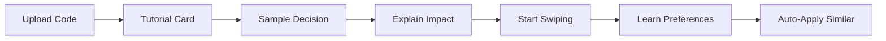
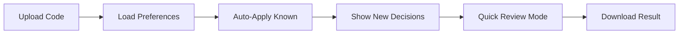

# Tinder Interface Specification

## Overview

The Tinder-style interface transforms complex code decisions into simple swipe gestures, making code cleanup intuitive and even enjoyable. Instead of overwhelming configuration files, users make quick decisions that train the AI to understand their preferences.

## Core Concept

```
Traditional: 100+ config options → Analysis paralysis
Tinder UI: Binary decisions → Rapid progress + AI learning
```

## User Interface Design

### Card Layout

```jsx
<SwipeableCard>
  <CardHeader>
    <Title>Remove unused imports?</Title>
    <FileContext>src/components/Dashboard.js</FileContext>
  </CardHeader>
  
  <CardBody>
    <CodeDiff>
      - import { useState, useEffect, useContext } from 'react';
      + import { useState } from 'react';
    </CodeDiff>
    
    <ImpactSummary>
      • Removes 2 unused imports
      • Saves 1.2KB in bundle size
      • No functionality changes
    </ImpactSummary>
  </CardBody>
  
  <CardFooter>
    <SwipeHints>
      ← Reject | Approve →
      ↓ Skip | Always ↑
    </SwipeHints>
  </CardFooter>
</SwipeableCard>
```

### Gesture Mapping

| Gesture | Action | Meaning | Keyboard |
|---------|--------|---------|----------|
| Swipe Right | Approve | Apply this change | → or D |
| Swipe Left | Reject | Skip this change | ← or A |
| Swipe Up | Always | Always do this type | ↑ or W |
| Swipe Down | Never | Never do this type | ↓ or S |
| Tap | Details | Show more context | Space |
| Long Press | Batch | Select multiple | Shift |

## Decision Categories

### 1. Code Style Decisions
```javascript
const styleDecisions = {
  'semicolons': 'Add or remove semicolons?',
  'quotes': 'Single or double quotes?',
  'indent': 'Tabs or spaces?',
  'trailing-comma': 'Add trailing commas?',
  'bracket-style': 'Bracket placement style?'
};
```

### 2. Refactoring Decisions
```javascript
const refactorDecisions = {
  'extract-function': 'Extract repeated code into function?',
  'rename-variable': 'Improve variable name?',
  'simplify-condition': 'Simplify complex condition?',
  'remove-dead-code': 'Remove unreachable code?',
  'consolidate-imports': 'Consolidate import statements?'
};
```

### 3. Performance Decisions
```javascript
const performanceDecisions = {
  'memoize-component': 'Add React.memo to component?',
  'lazy-load': 'Lazy load this module?',
  'optimize-loop': 'Optimize loop performance?',
  'cache-result': 'Cache expensive calculation?',
  'debounce-handler': 'Debounce event handler?'
};
```

### 4. Security Decisions
```javascript
const securityDecisions = {
  'sanitize-input': 'Add input sanitization?',
  'escape-output': 'Escape HTML output?',
  'validate-params': 'Add parameter validation?',
  'secure-headers': 'Add security headers?',
  'remove-secret': 'Remove hardcoded secret?'
};
```

## Technical Implementation

### SwipeableCard Component

```typescript
interface SwipeableCardProps {
  decision: Decision;
  onSwipe: (direction: SwipeDirection, preference: Preference) => void;
  onTap: () => void;
  index: number;
}

const SwipeableCard: React.FC<SwipeableCardProps> = ({
  decision,
  onSwipe,
  onTap,
  index
}) => {
  const [{ x, y }, api] = useSpring(() => ({ x: 0, y: 0 }));
  
  const bind = useDrag(({ down, movement: [mx, my], velocity }) => {
    const trigger = velocity > 0.2;
    const dir = mx > 0 ? 'right' : 'left';
    
    if (!down && trigger) {
      onSwipe(dir, getPreference(mx, my));
    }
    
    api.start({
      x: down ? mx : 0,
      y: down ? my : 0,
      config: { friction: 50, tension: down ? 800 : 500 }
    });
  });
  
  return (
    <animated.div
      {...bind()}
      style={{
        x,
        y,
        transform: to([x, y], (x, y) => 
          `translate3d(${x}px, ${y}px, 0) rotate(${x / 10}deg)`
        )
      }}
      onClick={onTap}
      className={styles.card}
    >
      <DecisionCard decision={decision} />
    </animated.div>
  );
};
```

### Decision Queue Management

```typescript
class DecisionQueue {
  private queue: Decision[] = [];
  private currentIndex: number = 0;
  private batchMode: boolean = false;
  private batchSelections: Set<number> = new Set();
  
  constructor(private ai: AIService) {}
  
  async loadDecisions(codebase: Codebase): Promise<void> {
    const analysis = await this.ai.analyzeCodebase(codebase);
    this.queue = this.prioritizeDecisions(analysis.decisions);
  }
  
  prioritizeDecisions(decisions: Decision[]): Decision[] {
    return decisions.sort((a, b) => {
      // Prioritize by impact and user history
      const scoreA = a.impact * this.getUserPreferenceWeight(a.type);
      const scoreB = b.impact * this.getUserPreferenceWeight(b.type);
      return scoreB - scoreA;
    });
  }
  
  async processDecision(
    index: number, 
    action: UserAction
  ): Promise<ProcessResult> {
    const decision = this.queue[index];
    
    // Record preference
    await this.ai.recordPreference(decision.type, action);
    
    // Apply decision
    if (action === 'approve' || action === 'always') {
      await this.applyChange(decision);
    }
    
    // Handle "always/never" preferences
    if (action === 'always' || action === 'never') {
      this.applyGlobalPreference(decision.type, action);
    }
    
    return { success: true, remaining: this.queue.length - index - 1 };
  }
  
  private applyGlobalPreference(type: string, action: string): void {
    // Filter future decisions based on preference
    this.queue = this.queue.filter(d => {
      if (d.type === type) {
        return action === 'always' ? this.autoApply(d) : false;
      }
      return true;
    });
  }
}
```

### Preference Learning System

```typescript
interface PreferenceProfile {
  userId: string;
  preferences: Map<string, PreferenceData>;
  patterns: Pattern[];
  accuracy: number;
}

class PreferenceLearner {
  private profiles: Map<string, PreferenceProfile> = new Map();
  
  async learn(userId: string, decision: Decision, action: UserAction) {
    const profile = this.getProfile(userId);
    
    // Update direct preference
    this.updatePreference(profile, decision.type, action);
    
    // Learn patterns
    const pattern = this.detectPattern(profile, decision, action);
    if (pattern) {
      profile.patterns.push(pattern);
    }
    
    // Update AI model
    await this.updateAIModel(profile);
  }
  
  detectPattern(
    profile: PreferenceProfile, 
    decision: Decision, 
    action: UserAction
  ): Pattern | null {
    // Detect patterns like:
    // - Always approves performance optimizations
    // - Never changes code style in tests
    // - Approves refactoring only in src/ directory
    
    const recentDecisions = this.getRecentDecisions(profile, 20);
    const similarity = this.calculateSimilarity(recentDecisions);
    
    if (similarity > 0.8) {
      return {
        type: 'behavioral',
        confidence: similarity,
        rule: this.generateRule(recentDecisions),
        context: decision.context
      };
    }
    
    return null;
  }
  
  async predict(userId: string, decision: Decision): Promise<PredictedAction> {
    const profile = this.getProfile(userId);
    
    // Check exact preferences
    const preference = profile.preferences.get(decision.type);
    if (preference?.confidence > 0.9) {
      return { action: preference.defaultAction, confidence: preference.confidence };
    }
    
    // Check patterns
    for (const pattern of profile.patterns) {
      if (this.matchesPattern(decision, pattern)) {
        return { action: pattern.predictedAction, confidence: pattern.confidence };
      }
    }
    
    // Use AI prediction
    return this.aiPredict(profile, decision);
  }
}
```

## User Experience Flow

### First-Time User


### Returning User


## UI Components

### Decision Card States
```scss
.card {
  &.pending {
    box-shadow: 0 4px 6px rgba(0, 0, 0, 0.1);
  }
  
  &.approving {
    background: linear-gradient(to right, #4ade80, transparent);
    transform: translateX(100vw) rotate(20deg);
  }
  
  &.rejecting {
    background: linear-gradient(to left, #f87171, transparent);
    transform: translateX(-100vw) rotate(-20deg);
  }
  
  &.always {
    background: linear-gradient(to top, #60a5fa, transparent);
    transform: translateY(-100vh) scale(0.8);
  }
  
  &.never {
    background: linear-gradient(to bottom, #fb923c, transparent);
    transform: translateY(100vh) scale(0.8);
  }
}
```

### Progress Indicator
```jsx
const ProgressIndicator = ({ current, total, categories }) => (
  <div className="progress-container">
    <div className="overall-progress">
      <div className="progress-bar" style={{ width: `${(current/total)*100}%` }} />
      <span className="progress-text">{current} / {total} decisions</span>
    </div>
    
    <div className="category-breakdown">
      {Object.entries(categories).map(([category, count]) => (
        <div key={category} className="category-progress">
          <Icon name={category} />
          <span>{count}</span>
        </div>
      ))}
    </div>
    
    <TimeEstimate remaining={total - current} />
  </div>
);
```

## Mobile Optimization

### Touch Gestures
```javascript
const mobileGestures = {
  swipeThreshold: 50, // pixels
  velocityThreshold: 0.5,
  tapDuration: 200, // ms
  longPressDuration: 500, // ms
  multiTouchEnabled: true
};
```

### Responsive Layouts
```scss
@media (max-width: 768px) {
  .decision-card {
    width: calc(100vw - 40px);
    height: calc(100vh - 200px);
    
    .code-diff {
      font-size: 12px;
      max-height: 40vh;
      overflow-y: auto;
    }
    
    .swipe-hints {
      position: fixed;
      bottom: 20px;
      font-size: 14px;
    }
  }
}
```

## Batch Mode

### Multi-Selection Interface
```typescript
interface BatchMode {
  enabled: boolean;
  selections: Set<number>;
  action: BatchAction;
  
  toggleSelection(index: number): void;
  applyBatchAction(action: UserAction): Promise<void>;
  selectSimilar(decision: Decision): void;
  clearSelections(): void;
}
```

### Batch Operations
```javascript
const batchOperations = {
  'select-all-style': 'Select all style decisions',
  'select-all-security': 'Select all security fixes',
  'select-by-file': 'Select all in current file',
  'select-by-impact': 'Select high-impact changes',
  'invert-selection': 'Invert current selection'
};
```

## Analytics & Metrics

### User Behavior Tracking
```typescript
interface SwipeMetrics {
  totalDecisions: number;
  approvalRate: number;
  averageDecisionTime: number;
  preferenceAccuracy: number;
  abandonmentRate: number;
  
  byCategory: Map<string, CategoryMetrics>;
  bySession: SessionMetrics[];
  patterns: DetectedPattern[];
}
```

### Decision Impact Analysis
```javascript
const impactMetrics = {
  codeQuality: {
    before: calculateMetrics(originalCode),
    after: calculateMetrics(processedCode),
    improvement: calculateImprovement()
  },
  bundleSize: {
    reduced: '15.3KB',
    percentage: '12%'
  },
  performance: {
    loadTime: '-200ms',
    runtime: '-50ms'
  }
};
```

## Gamification Elements

### Achievement System
```typescript
const achievements = [
  { id: 'first-swipe', name: 'First Decision', icon: '🎯' },
  { id: 'speed-demon', name: '100 decisions in 5 minutes', icon: '⚡' },
  { id: 'perfectionist', name: '95% consistency rate', icon: '💎' },
  { id: 'clean-freak', name: 'Removed 1000 lint errors', icon: '🧹' },
  { id: 'security-hero', name: 'Fixed 10 security issues', icon: '🛡️' }
];
```

### Streak Tracking
```jsx
const StreakCounter = ({ streak, bestStreak }) => (
  <div className="streak-container">
    <FireIcon className={streak > 10 ? 'burning' : ''} />
    <span className="current-streak">{streak}</span>
    <span className="best-streak">Best: {bestStreak}</span>
  </div>
);
```

## Integration Points

### API Endpoints
```typescript
// Decision queue management
POST   /api/decisions/load       // Load decisions for codebase
GET    /api/decisions/next       // Get next decision
POST   /api/decisions/:id/swipe  // Process swipe action
POST   /api/decisions/batch      // Batch operations

// Preference management  
GET    /api/preferences          // Get user preferences
POST   /api/preferences/learn    // Update preferences
DELETE /api/preferences/reset    // Reset preferences

// Analytics
POST   /api/analytics/swipe      // Track swipe action
GET    /api/analytics/summary    // Get session summary
```

This Tinder-style interface transforms the tedious task of code cleanup into an engaging, almost addictive experience while building a powerful preference profile for each user.