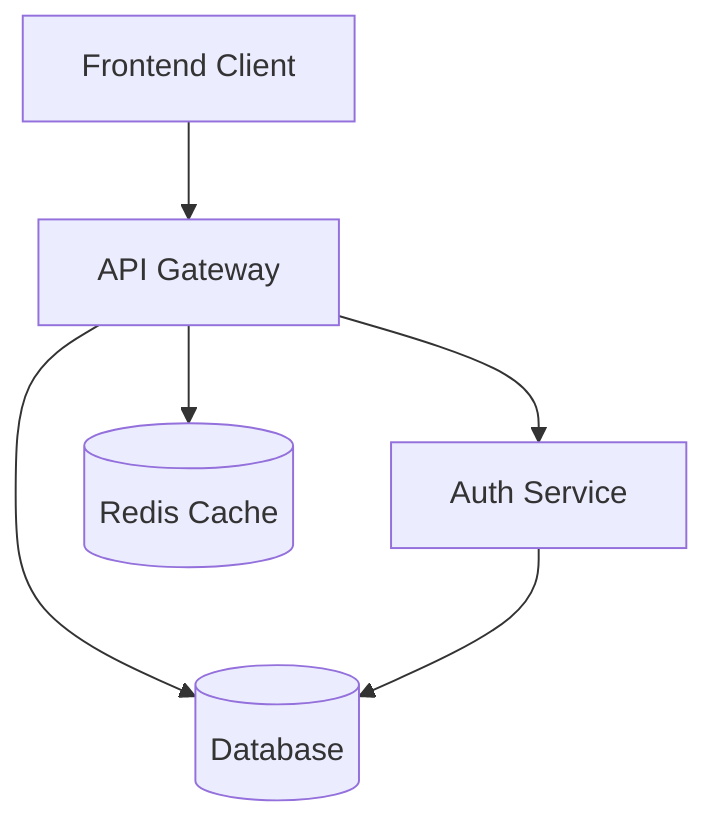

# Documentation Generator Service

## Overview

The Documentation Generator Service creates comprehensive, AI-optimized documentation from existing codebases. Based on research showing AI development requires 3-5x more documentation than traditional development, this service bridges the gap between code and understanding.

## Service Details

**Pricing Tiers:**
- **Indie Developer**: $3 - Basic README and API docs
- **Professional**: $25 - Complete technical documentation
- **Enterprise**: $50-150K - AI-optimized documentation infrastructure

**Processing Time**: 
- Basic: 5-10 minutes
- Professional: 30-60 minutes
- Enterprise: 2-3 weeks (includes consultation)

## What It Generates

### Basic Documentation ($3)
```
✓ README.md with:
  - Project overview
  - Installation instructions
  - Basic usage examples
  - API reference
  - Contributing guidelines

✓ Code comments:
  - Function documentation
  - Complex logic explanation
  - TODO extraction
```

### Professional Documentation ($25)
```
✓ Everything in Basic, plus:
  - Architecture diagrams
  - Data flow documentation
  - API specifications (OpenAPI/Swagger)
  - Database schema docs
  - Deployment guides
  - Testing documentation
  - Security considerations
  - Performance guidelines
```

### Enterprise Documentation ($50-150K)
```
✓ Everything in Professional, plus:
  - AI-optimized documentation (3-5x detail)
  - Business context documentation
  - Machine-readable specifications
  - Integration patterns library
  - Custom documentation templates
  - Ongoing documentation maintenance
  - Team training on AI documentation
```

## How It Works

### 1. Code Analysis

The service analyzes your codebase to understand:
- Project structure and architecture
- Dependencies and technologies used
- API endpoints and data models
- Business logic and workflows
- Existing documentation gaps

### 2. AI-Powered Generation

```typescript
// Progressive enhancement approach
1. Ollama (Local) - Quick documentation drafts
2. GPT-3.5 - Detailed technical documentation
3. Claude/GPT-4 - Complex architectural documentation
```

### 3. Documentation Structure

```yaml
generated-docs/
├── README.md              # Project overview
├── ARCHITECTURE.md        # System design
├── API.md                 # API reference
├── DEPLOYMENT.md          # Deployment guide
├── CONTRIBUTING.md        # Contribution guidelines
├── docs/
│   ├── getting-started/   # Tutorials
│   ├── api/              # Detailed API docs
│   ├── architecture/     # Technical details
│   └── guides/           # How-to guides
└── examples/             # Code examples
```

## AI-Optimized Documentation

Based on research showing AI tools need 3-5x more context than humans:

### Standard vs AI-Optimized

**Standard Documentation:**
```markdown
## User Authentication
Handles user login and registration.
```

**AI-Optimized Documentation:**
```yaml
User Authentication:
  purpose: "Manages user identity and access control"
  business_rules:
    - "Users must verify email before activation"
    - "Passwords require 8+ chars, 1 uppercase, 1 number"
    - "Session timeout after 24 hours of inactivity"
  
  technical_details:
    endpoints:
      - POST /auth/register
      - POST /auth/login
      - POST /auth/logout
      - GET /auth/verify-email
    
    data_flow:
      registration:
        1. "Validate email uniqueness"
        2. "Hash password with bcrypt (10 rounds)"
        3. "Create user record with pending status"
        4. "Send verification email"
        5. "Log registration event"
    
    error_cases:
      - email_exists: "User with email already registered"
      - weak_password: "Password doesn't meet requirements"
      - invalid_token: "Email verification token expired"
```

## Key Features

### 1. Automatic API Documentation

Generates OpenAPI/Swagger specifications from code:

```typescript
// Input: Your API endpoint
app.post('/api/users', validateUser, async (req, res) => {
  const user = await createUser(req.body);
  res.json(user);
});

// Output: OpenAPI specification
paths:
  /api/users:
    post:
      summary: Create a new user
      requestBody:
        required: true
        content:
          application/json:
            schema:
              $ref: '#/components/schemas/CreateUserRequest'
      responses:
        200:
          description: User created successfully
          content:
            application/json:
              schema:
                $ref: '#/components/schemas/User'
```

### 2. Architecture Diagram Generation

Creates visual representations using Mermaid:



### 3. Business Logic Documentation

Extracts and documents business rules:

```typescript
// Extracts rules like:
- Order minimum: $10
- Free shipping over $50
- Tax calculation based on state
- Inventory updates on purchase
- Email notifications for order status
```

## Use Cases

### For Indie Developers
- **Before**: Spend days writing basic docs
- **After**: Get professional docs in minutes
- **Value**: More time coding, better project presentation

### For Agencies
- **Before**: Manual documentation for each client project
- **After**: Automated docs with consistent quality
- **Value**: Higher client satisfaction, faster delivery

### For Enterprises
- **Before**: $50-150K on documentation consultants
- **After**: AI-optimized docs at fraction of cost
- **Value**: 50% faster AI tool adoption, reduced development time

## Quality Guarantees

1. **Accuracy**: AI-verified against codebase
2. **Completeness**: Coverage reports included
3. **Clarity**: Readability score > 80
4. **Currency**: Auto-update notifications
5. **Searchability**: SEO-optimized content

## Related Services

- [API Generator](api-generator.md) - Generate APIs from docs
- [Test Generator](test-generator.md) - Create tests from docs
- [Code Generation](code-generation.md) - Generate code from docs

---

*Based on research: "AI development assistants need 3-5x more contextual information than human developers for equivalent output quality."*