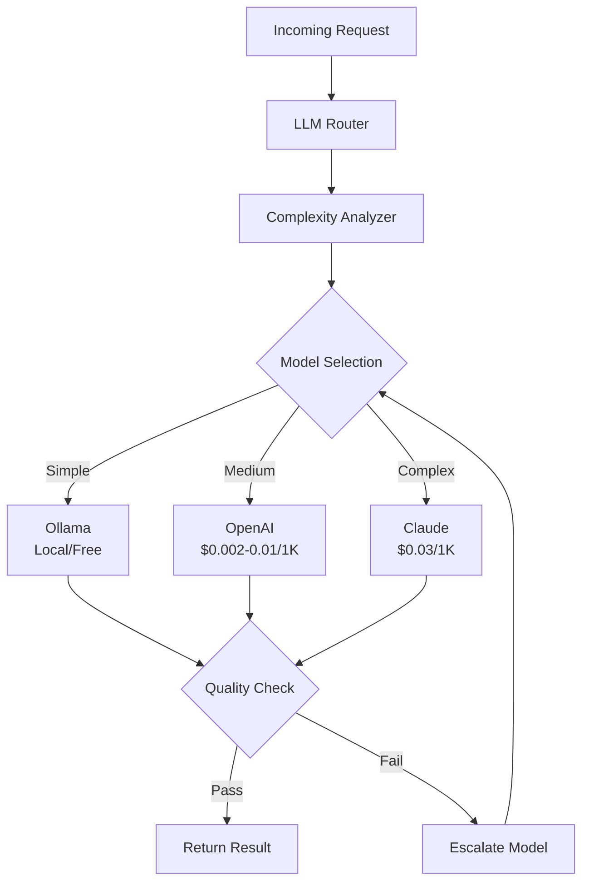

# LLM Router Service

## Overview

The LLM Router is the brain of FinishThisIdea - an intelligent routing system that automatically selects the best AI model for each task while minimizing costs. It implements progressive enhancement, starting with free local models and only escalating to paid cloud services when necessary.

## Service Architecture



## Core Features

### 1. Intelligent Model Selection

```typescript
interface ModelSelector {
  // Analyze request complexity
  analyzeComplexity(request: LLMRequest): ComplexityScore;
  
  // Select optimal model
  selectModel(complexity: ComplexityScore): ModelChoice;
  
  // Track performance
  recordOutcome(model: string, success: boolean, cost: number): void;
}

class ComplexityAnalyzer {
  analyze(request: LLMRequest): ComplexityScore {
    const factors = {
      // Token count
      length: this.getTokenCount(request.prompt),
      
      // Task type
      taskComplexity: this.getTaskComplexity(request.type),
      
      // Language complexity
      languageFeatures: this.analyzeLanguageFeatures(request.code),
      
      // Required accuracy
      accuracyNeeded: request.minConfidence || 0.8,
      
      // Time constraints
      deadline: request.maxLatency || Infinity
    };
    
    return this.calculateScore(factors);
  }
}
```

### 2. Progressive Enhancement

```typescript
class ProgressiveRouter {
  private readonly models = [
    {
      name: 'ollama-codellama',
      cost: 0,
      latency: 100,  // ms
      accuracy: 0.75,
      local: true
    },
    {
      name: 'gpt-3.5-turbo',
      cost: 0.002,   // per 1K tokens
      latency: 1000,
      accuracy: 0.85,
      local: false
    },
    {
      name: 'gpt-4-turbo',
      cost: 0.01,
      latency: 2000,
      accuracy: 0.92,
      local: false
    },
    {
      name: 'claude-3-opus',
      cost: 0.03,
      latency: 3000,
      accuracy: 0.95,
      local: false
    }
  ];
  
  async route(request: LLMRequest): Promise<LLMResponse> {
    const complexity = this.analyzer.analyze(request);
    
    // Start with cheapest model that might work
    let modelIndex = this.getStartingModel(complexity);
    
    while (modelIndex < this.models.length) {
      const model = this.models[modelIndex];
      
      try {
        const response = await this.callModel(model, request);
        
        // Check quality
        if (response.confidence >= request.minConfidence) {
          this.recordSuccess(model, request, response);
          return response;
        }
        
        // Try next model
        modelIndex++;
      } catch (error) {
        this.recordFailure(model, error);
        modelIndex++;
      }
    }
    
    throw new Error('No model could handle this request');
  }
}
```

### 3. Cost Optimization

```typescript
class CostOptimizer {
  private costBudget: Map<string, number> = new Map();
  private usage: Map<string, UsageStats> = new Map();
  
  async optimizeRequest(request: LLMRequest): Promise<ModelChoice> {
    const userId = request.userId;
    const userBudget = this.costBudget.get(userId) || Infinity;
    const userUsage = this.usage.get(userId) || { total: 0, models: {} };
    
    // Calculate remaining budget
    const remainingBudget = userBudget - userUsage.total;
    
    // Find best model within budget
    const affordableModels = this.models.filter(m => 
      this.estimateCost(m, request) <= remainingBudget
    );
    
    if (affordableModels.length === 0) {
      // Only use free models
      return { model: 'ollama-codellama', reason: 'budget_exceeded' };
    }
    
    // Select optimal model
    return this.selectOptimal(affordableModels, request);
  }
  
  private estimateCost(model: Model, request: LLMRequest): number {
    const tokens = this.estimateTokens(request);
    return (tokens / 1000) * model.costPer1K;
  }
}
```

### 4. Model-Specific Adapters

#### Ollama Adapter

```typescript
class OllamaAdapter implements ModelAdapter {
  private pool: OllamaInstance[] = [];
  
  async initialize() {
    // Discover available Ollama instances
    this.pool = await this.discoverInstances();
    
    // Pre-load models
    await Promise.all(
      this.pool.map(instance => 
        instance.loadModel('codellama')
      )
    );
  }
  
  async complete(prompt: string): Promise<CompletionResult> {
    // Round-robin load balancing
    const instance = this.getNextInstance();
    
    const response = await fetch(`${instance.url}/api/generate`, {
      method: 'POST',
      headers: { 'Content-Type': 'application/json' },
      body: JSON.stringify({
        model: 'codellama',
        prompt,
        stream: false,
        options: {
          temperature: 0.2,
          top_p: 0.9,
          num_predict: 2048
        }
      })
    });
    
    const result = await response.json();
    
    return {
      text: result.response,
      confidence: this.calculateConfidence(result),
      tokens: result.eval_count,
      latency: result.total_duration / 1000000 // Convert to ms
    };
  }
}
```

#### OpenAI Adapter

```typescript
class OpenAIAdapter implements ModelAdapter {
  private client: OpenAI;
  private rateLimiter: RateLimiter;
  
  constructor() {
    this.client = new OpenAI({
      apiKey: process.env.OPENAI_API_KEY
    });
    
    this.rateLimiter = new RateLimiter({
      requestsPerMinute: 3000,
      tokensPerMinute: 90000
    });
  }
  
  async complete(prompt: string, model: string): Promise<CompletionResult> {
    await this.rateLimiter.acquire();
    
    const response = await this.client.chat.completions.create({
      model,
      messages: [{ role: 'user', content: prompt }],
      temperature: 0.2,
      max_tokens: 2048,
      top_p: 0.9
    });
    
    const choice = response.choices[0];
    
    return {
      text: choice.message.content,
      confidence: this.calculateConfidence(choice),
      tokens: response.usage.total_tokens,
      cost: this.calculateCost(response.usage, model)
    };
  }
}
```

#### Claude Adapter

```typescript
class ClaudeAdapter implements ModelAdapter {
  private client: Anthropic;
  
  constructor() {
    this.client = new Anthropic({
      apiKey: process.env.ANTHROPIC_API_KEY
    });
  }
  
  async complete(prompt: string): Promise<CompletionResult> {
    const response = await this.client.messages.create({
      model: 'claude-3-opus-20240229',
      messages: [{ role: 'user', content: prompt }],
      max_tokens: 4096,
      temperature: 0.2
    });
    
    return {
      text: response.content[0].text,
      confidence: 0.95, // Claude typically has high confidence
      tokens: response.usage.input_tokens + response.usage.output_tokens,
      cost: this.calculateCost(response.usage)
    };
  }
}
```

### 5. Quality Assurance

```typescript
class QualityChecker {
  async validateResponse(
    response: LLMResponse,
    request: LLMRequest
  ): Promise<QualityScore> {
    const checks = {
      // Syntax validation
      syntaxValid: await this.checkSyntax(response.code, request.language),
      
      // Completeness
      complete: this.checkCompleteness(response.code),
      
      // No harmful patterns
      safe: this.checkSafety(response.code),
      
      // Follows instructions
      accurate: this.checkAccuracy(response.code, request.prompt),
      
      // Performance impact
      performant: await this.checkPerformance(response.code)
    };
    
    const score = this.calculateQualityScore(checks);
    
    return {
      score,
      passed: score >= request.minQuality,
      issues: this.getIssues(checks)
    };
  }
}
```

## API Reference

### Router Configuration

```typescript
interface RouterConfig {
  // Model availability
  models: {
    ollama: {
      enabled: boolean;
      urls: string[];
      models: string[];
    };
    openai: {
      enabled: boolean;
      apiKey: string;
      models: string[];
      maxCostPerRequest?: number;
    };
    anthropic: {
      enabled: boolean;
      apiKey: string;
      models: string[];
      maxCostPerRequest?: number;
    };
  };
  
  // Routing strategy
  strategy: {
    costWeight: number;      // 0-1, importance of cost
    qualityWeight: number;   // 0-1, importance of quality
    speedWeight: number;     // 0-1, importance of speed
    preferLocal: boolean;    // Always try local first
  };
  
  // Quality thresholds
  quality: {
    minConfidence: number;   // 0-1, minimum acceptable
    maxRetries: number;      // How many escalations
    syntaxCheck: boolean;    // Validate syntax
  };
  
  // Cost controls
  cost: {
    maxPerRequest: number;   // Maximum $ per request
    maxPerUser: number;      // Maximum $ per user/day
    alertThreshold: number;  // Alert when cost exceeds
  };
}
```

### Request Interface

```typescript
interface LLMRequest {
  // Required
  prompt: string;              // The prompt to send
  type: TaskType;              // cleanup, refactor, etc.
  
  // Optional
  code?: string;               // Code context
  language?: string;           // Programming language
  userId?: string;             // For cost tracking
  
  // Constraints
  minConfidence?: number;      // Minimum confidence (0-1)
  maxLatency?: number;         // Maximum response time (ms)
  maxCost?: number;            // Maximum cost ($)
  
  // Preferences
  preferredModel?: string;     // Hint for model selection
  style?: CodingStyle;         // Coding style preferences
}
```

### Response Interface

```typescript
interface LLMResponse {
  // Result
  text: string;                // Generated text
  code?: string;               // Extracted code
  changes?: CodeChange[];      // Structured changes
  
  // Metadata
  model: string;               // Model used
  confidence: number;          // Confidence score (0-1)
  
  // Performance
  latency: number;             // Response time (ms)
  tokens: {
    prompt: number;            // Input tokens
    completion: number;        // Output tokens
    total: number;             // Total tokens
  };
  
  // Cost
  cost: {
    amount: number;            // Cost in dollars
    breakdown: CostBreakdown;  // Detailed breakdown
  };
  
  // Quality
  quality: {
    score: number;             // Quality score (0-1)
    issues: string[];          // Any issues found
  };
}
```

## Usage Examples

### Basic Usage

```typescript
import { LLMRouter } from '@finishthisidea/llm-router';

const router = new LLMRouter({
  models: {
    ollama: { enabled: true, urls: ['http://localhost:11434'] },
    openai: { enabled: true, apiKey: process.env.OPENAI_API_KEY },
    anthropic: { enabled: true, apiKey: process.env.ANTHROPIC_API_KEY }
  },
  strategy: {
    costWeight: 0.4,
    qualityWeight: 0.4,
    speedWeight: 0.2,
    preferLocal: true
  }
});

// Simple request
const response = await router.complete({
  prompt: 'Fix the syntax errors in this code',
  code: 'const x = 1;\nconst y = 2;\nconst z = x + y',
  type: 'cleanup',
  language: 'javascript'
});
```

### Cost-Conscious Usage

```typescript
// Set strict cost limits
const response = await router.complete({
  prompt: 'Generate unit tests for this function',
  code: functionCode,
  type: 'test-generation',
  maxCost: 0.10,  // Maximum 10 cents
  userId: 'user123'
});

// Check cost before proceeding
if (response.cost.amount > 0.05) {
  console.warn(`High cost operation: $${response.cost.amount}`);
}
```

### Quality-First Usage

```typescript
// Require high confidence
const response = await router.complete({
  prompt: 'Refactor this code for better performance',
  code: complexCode,
  type: 'refactor',
  minConfidence: 0.95,  // Will likely use Claude
  maxLatency: 10000     // Allow up to 10 seconds
});

// Validate quality
if (response.quality.score < 0.9) {
  throw new Error('Quality too low: ' + response.quality.issues.join(', '));
}
```

### Batch Processing

```typescript
// Process multiple requests efficiently
const requests = files.map(file => ({
  prompt: 'Add TypeScript types',
  code: file.content,
  type: 'typescript-conversion',
  language: 'javascript'
}));

// Batch with Ollama for cost efficiency
const responses = await router.batchComplete(requests, {
  preferredModel: 'ollama-codellama',
  maxConcurrency: 5
});
```

## Performance Optimization

### Caching Strategy

```typescript
class CachedRouter extends LLMRouter {
  private cache = new LRUCache<string, LLMResponse>({
    max: 1000,
    ttl: 1000 * 60 * 60 // 1 hour
  });
  
  async complete(request: LLMRequest): Promise<LLMResponse> {
    const cacheKey = this.getCacheKey(request);
    
    // Check cache
    const cached = this.cache.get(cacheKey);
    if (cached) {
      return { ...cached, fromCache: true };
    }
    
    // Process request
    const response = await super.complete(request);
    
    // Cache if successful
    if (response.quality.score > 0.8) {
      this.cache.set(cacheKey, response);
    }
    
    return response;
  }
}
```

### Connection Pooling

```typescript
class PooledOllamaAdapter {
  private pool: ConnectionPool;
  
  constructor(urls: string[]) {
    this.pool = new ConnectionPool({
      connections: urls.map(url => ({
        url,
        maxConcurrent: 10,
        keepAlive: true
      })),
      healthCheck: async (conn) => {
        const response = await fetch(`${conn.url}/api/tags`);
        return response.ok;
      },
      retryStrategy: exponentialBackoff({
        maxRetries: 3,
        initialDelay: 1000
      })
    });
  }
}
```

## Monitoring & Analytics

### Metrics Collection

```typescript
interface RouterMetrics {
  // Request metrics
  requests: {
    total: number;
    byModel: Record<string, number>;
    byType: Record<TaskType, number>;
  };
  
  // Performance metrics
  performance: {
    avgLatency: number;
    p95Latency: number;
    p99Latency: number;
    timeouts: number;
  };
  
  // Cost metrics
  cost: {
    total: number;
    byModel: Record<string, number>;
    byUser: Record<string, number>;
    avgPerRequest: number;
  };
  
  // Quality metrics
  quality: {
    avgConfidence: number;
    failureRate: number;
    escalationRate: number;
  };
}
```

### Dashboard Integration

```typescript
class RouterDashboard {
  async getMetrics(timeRange: TimeRange): Promise<DashboardData> {
    const metrics = await this.collectMetrics(timeRange);
    
    return {
      summary: {
        requestsPerHour: metrics.requests.total / timeRange.hours,
        avgCost: metrics.cost.avgPerRequest,
        successRate: 1 - metrics.quality.failureRate,
        ollamaUsage: metrics.requests.byModel.ollama / metrics.requests.total
      },
      
      charts: {
        costOverTime: this.generateCostChart(metrics),
        modelDistribution: this.generateModelChart(metrics),
        latencyHistogram: this.generateLatencyChart(metrics),
        qualityTrend: this.generateQualityChart(metrics)
      },
      
      alerts: this.checkAlerts(metrics)
    };
  }
}
```

## Best Practices

### 1. Start Local
```typescript
// Always enable Ollama for cost efficiency
const router = new LLMRouter({
  models: {
    ollama: {
      enabled: true,
      urls: [
        'http://localhost:11434',
        'http://ollama-1:11434',
        'http://ollama-2:11434'
      ]
    }
  },
  strategy: {
    preferLocal: true  // Try Ollama first
  }
});
```

### 2. Set Cost Limits
```typescript
// Protect against runaway costs
router.setCostLimits({
  maxPerRequest: 1.00,    // $1 maximum
  maxPerUser: 100.00,     // $100/day per user
  maxPerHour: 50.00       // $50/hour total
});
```

### 3. Monitor Quality
```typescript
// Track quality degradation
router.on('quality-drop', (event) => {
  if (event.model === 'ollama' && event.score < 0.7) {
    // Consider scaling Ollama cluster
    notifyOps('Ollama quality degradation detected');
  }
});
```

### 4. Handle Failures Gracefully
```typescript
// Implement fallback logic
try {
  const response = await router.complete(request);
  return response;
} catch (error) {
  if (error.code === 'ALL_MODELS_FAILED') {
    // Return cached response or default
    return getCachedResponse(request) || getDefaultResponse(request);
  }
  throw error;
}
```

## Troubleshooting

### Common Issues

1. **High Costs**
   - Check if Ollama is properly configured
   - Review complexity analyzer thresholds
   - Enable cost alerts

2. **Slow Responses**
   - Add more Ollama instances
   - Check network latency to APIs
   - Review timeout settings

3. **Quality Issues**
   - Fine-tune prompt templates
   - Adjust confidence thresholds
   - Consider model-specific prompts

4. **Connection Errors**
   - Verify API keys are valid
   - Check firewall rules
   - Test with curl commands

## Related Documentation

- [System Architecture](../02-architecture/system-design.md)
- [Code Cleanup Service](mvp-cleanup.md)
- [API Reference](../06-api/README.md)
- [Cost Optimization](../08-operations/cost-optimization.md)

---

*Last Updated: 2024-01-20*