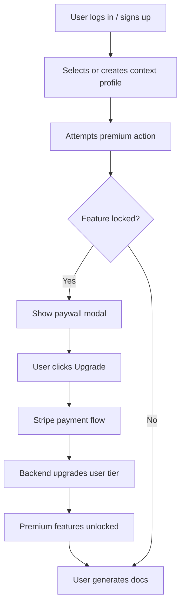

# UX Flow: Context Profile–Aware Paywall & Document Generation

This document describes the user experience flow for the context profile–aware paywall and document generator integration.

---

## 1. User Flow Description
1. User logs in or signs up
2. User selects or creates a context profile
3. User attempts a premium action (e.g., batch processing, advanced template)
4. System checks user tier and context profile
5. If feature is locked, show paywall modal with profile-relevant messaging
6. User clicks "Upgrade" and completes Stripe payment
7. Backend upgrades user tier and logs context profile
8. User is redirected back, premium features are unlocked
9. User generates documents with new features enabled

---

## 2. Mermaid Diagram

---

*Update this flow as the UX evolves. For questions, see the module README.* 