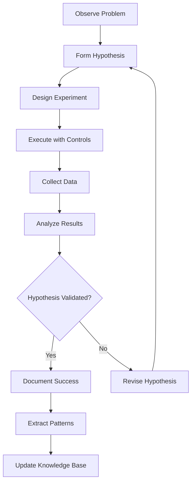

# Scientific Method Workflow for Document Generator

> "Nature, and Nature's laws lay hid in night:  
> God said, 'Let Newton be!' and all was light." - Alexander Pope

This document defines our scientific method workflow for debugging, development, and system improvement. Every change is an experiment, every bug is a hypothesis to test.

## Core Principles

### 1. Observation Before Action
- Document what you see, not what you think
- Capture visual evidence (screenshots, logs, metrics)
- Record environmental conditions
- Note patterns and anomalies

### 2. Hypothesis Formation
- State clearly what you believe is happening
- Make testable predictions
- Define success criteria upfront
- Consider alternative explanations

### 3. Controlled Experimentation
- Change one variable at a time
- Keep detailed logs of all actions
- Use visual documentation throughout
- Ensure reproducibility

### 4. Analysis and Conclusion
- Compare results to predictions
- Document unexpected findings
- Extract patterns for future use
- Share knowledge with the system

## Experiment Workflow



## Experiment Types

### 1. Debugging Experiments
**Purpose**: Identify and fix system failures

```javascript
// Example: System Bus Service Debug
{
  type: 'debugging',
  observation: 'Service shows as failed in dashboard',
  hypothesis: 'Port conflict preventing connection',
  methodology: [
    'Check service logs',
    'Scan for port usage',
    'Test with alternate ports',
    'Verify dependencies'
  ],
  successCriteria: [
    'Service connects successfully',
    'Health check passes',
    'No port conflicts'
  ]
}
```

### 2. Performance Experiments
**Purpose**: Optimize system performance

```javascript
{
  type: 'performance',
  observation: 'Slow response times on document processing',
  hypothesis: 'Lack of caching causing repeated AI calls',
  methodology: [
    'Measure baseline performance',
    'Implement Redis caching',
    'Measure improved performance',
    'Compare results'
  ],
  metrics: [
    'Response time (ms)',
    'AI API calls',
    'Cache hit rate',
    'Memory usage'
  ]
}
```

### 3. Integration Experiments
**Purpose**: Test component interactions

```javascript
{
  type: 'integration',
  observation: 'Components work individually but fail together',
  hypothesis: 'Event bus not properly routing messages',
  methodology: [
    'Trace message flow',
    'Log all events',
    'Test each integration point',
    'Verify data formats'
  ],
  controls: [
    'Isolated test environment',
    'Known good test data',
    'Version locking'
  ]
}
```

### 4. Educational Experiments
**Purpose**: Learn and document system behavior

```javascript
{
  type: 'educational',
  observation: 'Unclear how template matching works',
  hypothesis: 'System uses semantic similarity for matching',
  methodology: [
    'Create test documents',
    'Observe matching behavior',
    'Modify parameters',
    'Document patterns'
  ],
  learningGoals: [
    'Understand matching algorithm',
    'Identify edge cases',
    'Create better documentation'
  ]
}
```

## Experiment Execution Protocol

### Phase 1: Preparation
1. **Clear Problem Statement**
   - What exactly is broken/unknown?
   - What is the impact?
   - What have we tried before?

2. **Environment Setup**
   - Document system state
   - Capture initial visuals
   - Note all configurations
   - Backup if necessary

3. **Hypothesis Development**
   - State your theory clearly
   - List assumptions
   - Define measurable outcomes
   - Consider alternatives

### Phase 2: Execution
1. **Start Experiment**
   ```javascript
   const {experiment, logger} = await journal.startExperiment(experimentId);
   ```

2. **Document Everything**
   ```javascript
   // Log each step
   await logger.log('Checking service configuration', {file: 'config.json'});
   
   // Capture visuals
   await logger.visual('Before configuration change');
   
   // Record measurements
   await logger.measure('memory_usage', process.memoryUsage().heapUsed, 'bytes');
   ```

3. **Make Controlled Changes**
   - One variable at a time
   - Document what changed
   - Capture state after each change
   - Be ready to rollback

### Phase 3: Analysis
1. **Collect Results**
   ```javascript
   await journal.completeExperiment(experimentId, {
     outcome: 'Fixed: Changed port from 8080 to 8090',
     hypothesisValidated: true,
     learnings: [
       'Port 8080 was already in use by Platform Hub',
       'Service needs explicit port configuration',
       'Health checks need timeout adjustment'
     ],
     futureWork: [
       'Implement automatic port detection',
       'Add port conflict warnings to startup'
     ]
   });
   ```

2. **Compare to Hypothesis**
   - Did results match predictions?
   - What was unexpected?
   - What new questions arose?

3. **Extract Patterns**
   - Common failure modes
   - Successful approaches
   - Environmental factors
   - Reusable solutions

## Visual Documentation Requirements

### Required Visuals
1. **Initial State** - Screenshot/bitmap before changes
2. **Each Major Step** - Visual proof of actions
3. **Error States** - Capture all errors visually
4. **Final State** - Proof of resolution
5. **Comparison** - Before/after visualization

### Visual Formats
- Screenshots (PNG)
- Bitmap health grids (32x12)
- Log excerpts with highlighting
- Performance graphs
- Architecture diagrams

## Experiment Journal Commands

### Create New Experiment
```bash
node experiment-journal-cli.js create \
  --title "Debug Redis Connection" \
  --hypothesis "Redis connection fails due to missing auth" \
  --category debugging
```

### Start Experiment
```bash
node experiment-journal-cli.js start <experiment-id>
```

### Log Findings
```bash
node experiment-journal-cli.js log <experiment-id> "Found issue in redis.conf"
```

### Complete Experiment
```bash
node experiment-journal-cli.js complete <experiment-id> \
  --validated true \
  --outcome "Fixed by adding Redis password"
```

### Search Experiments
```bash
# Find all Redis-related experiments
node experiment-journal-cli.js search --text "redis"

# Find all successful debugging experiments
node experiment-journal-cli.js search --category debugging --validated true

# Find highly reproducible experiments
node experiment-journal-cli.js search --min-reproducibility 90
```

## Reproducibility Standards

### Minimum Requirements
1. **Clear Steps** - Anyone can follow
2. **Environment Details** - OS, versions, configs
3. **Test Data** - Provide or generate
4. **Expected Results** - Define success
5. **Visual Proof** - Screenshots/bitmaps

### Reproducibility Score Factors
- Complete methodology (20%)
- Environmental documentation (15%)
- Visual documentation (15%)
- Clear success criteria (10%)
- Detailed logs (10%)
- Control variables defined (15%)
- Initial state captured (15%)

## Knowledge Extraction

### After Each Experiment
1. **Update Patterns Database**
   ```javascript
   const patterns = await journal.extractPatterns();
   ```

2. **Generate Learning Report**
   ```javascript
   const report = await journal.generateLearningReport(experimentId);
   ```

3. **Create Reusable Solutions**
   ```javascript
   const solution = await journal.createSolution(experimentId, {
     name: 'Fix Redis Auth Error',
     steps: experiment.methodology.steps,
     applicableTo: ['Redis connection errors', 'Auth failures']
   });
   ```

## Integration with Existing Systems

### Visual Dashboard
- Experiments appear in monitoring dashboard
- Real-time experiment status
- Visual progress indicators
- Success/failure metrics

### QR Verification
- Each experiment gets unique QR code
- Scan to view full experiment details
- Tamper-proof checksums
- Audit trail for compliance

### Knowledge Base
- Searchable experiment archive
- Pattern recognition
- Solution recommendations
- Learning pathway generation

## Best Practices

### DO:
- ✅ Start with clear observations
- ✅ Form testable hypotheses
- ✅ Document everything visually
- ✅ Change one thing at a time
- ✅ Measure before and after
- ✅ Share findings with team
- ✅ Build on previous experiments

### DON'T:
- ❌ Skip documentation to "save time"
- ❌ Make multiple changes at once
- ❌ Ignore unexpected results
- ❌ Hide failures
- ❌ Forget to capture visuals
- ❌ Work without a hypothesis

## Example: Complete Debugging Workflow

```javascript
// 1. Observe problem
const problem = {
  service: 'System Bus Service',
  status: 'Failed',
  dashboard: 'Shows 75% health (9/12 passing)'
};

// 2. Create experiment
const experiment = await journal.createExperiment({
  title: 'Debug System Bus Service Failure',
  problem: problem.service + ' not connecting',
  hypothesis: 'Port conflict with Platform Hub on 8080',
  steps: [
    'Check current port usage',
    'Review service configuration',
    'Test alternate ports',
    'Update configuration',
    'Verify connection'
  ]
});

// 3. Execute experiment
const {logger} = await journal.startExperiment(experiment.id);

// Check ports
await logger.log('Checking port 8080');
const portCheck = await checkPort(8080);
await logger.log('Port 8080 in use by', portCheck);

// Visual proof
await logger.visual('Port conflict detected');

// Try alternate port
await logger.log('Testing port 8090');
await updateServicePort(8090);
await logger.visual('After port change');

// 4. Complete and analyze
await journal.completeExperiment(experiment.id, {
  outcome: 'Fixed by changing port to 8090',
  hypothesisValidated: true,
  learnings: [
    'Platform Hub uses 8080 by default',
    'Need better port conflict detection',
    'Services should auto-negotiate ports'
  ]
});
```

## Continuous Improvement

### Weekly Reviews
1. Review all experiments
2. Extract common patterns
3. Update documentation
4. Share learnings

### Monthly Analysis
1. Success rate trends
2. Common failure modes
3. Time to resolution
4. Knowledge gaps

### Quarterly Planning
1. Systematic improvements
2. Tool enhancements
3. Training needs
4. Process optimization

---

*"In the middle of difficulty lies opportunity." - Albert Einstein*

*Every bug is a chance to learn. Every failure is data. Every experiment brings us closer to understanding.*
